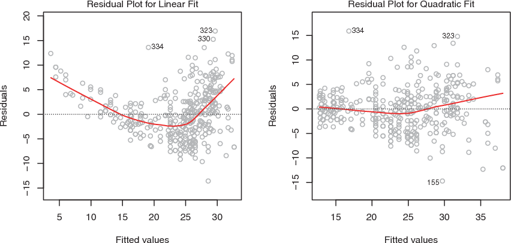
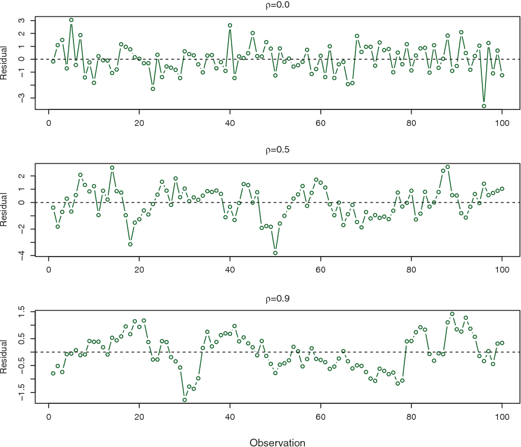
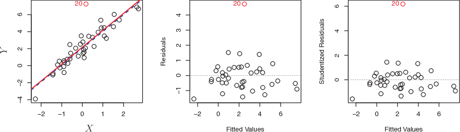
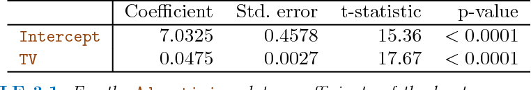

```{r setup, include = FALSE}

knitr::opts_chunk$set(comment = "#>",collapse = TRUE)
```

# Linear Regression

## Simple Linear Regression

***Simple linear regression*** is a very straightforward approach for predicting a qualitative response $Y$ on the basis of a single predictor $X$. Mathematically, we can write this linear relationship as

$$
Y \approx \beta_0 + \beta_1 X
$$

Whereas:

* $\beta_0$: intercept
* $\beta_1$: slope

### Estimating the Coefficients

In practice, $\beta_0$ and $\beta_1$ are unknown. So before make predictions, we must use data to estimate the coefficients. Let $(x_1, Y_1), (x_2, Y_2),...,(x_n, Y_n)$
represent $n$ observation pairs, each of which consists of a measurement of $X$ and a measurement of $Y$. Our goal is to obtain coefficient estimates $\beta_0$ and $\beta_1$ such that the linear model fits the available data well. In other words, we want to find an intercept $\beta_0$ and a slope $\beta_1$ such that the resulting line is as close as possible to the $n$ data points.


There are numbers of ways of measuring *closeness*. However, by far the most common approach involves minimizing the *least squares* criterion, and we take that approach in this chapter.


#### The Least Square Approach {-}

Let $Y_i = \beta_0 + \beta_1 X_i$ be the prediction for $Y$ based on the $i$th value of $X$. Then $e_i = y_i -\hat{y}+i$ represents the $i$th *residual* - this is the difference between the $i$th value and the $i$th reponse value that is predicted by our linear model. We define the ***residual sum of square (RSS)*** as

$$
RSS = e_1^2 + e_2^2 + ... + e_n^2
$$

or equivalent as 
$$
RSS = (y_1 - \hat{\beta_0} - \hat{\beta_1}x_2)^2 + (y_2 - \hat{\beta_0} - \hat{\beta_1}x_2)^2  + ... + (y_n - \hat{\beta_0} - \hat{\beta_1}x_n)^2
$$

***The least square approach*** chooses $\hat{\beta_0}$ and $\hat{\beta_1}$ to minimize the RSS.


### Assessing the Accuracy of the Coefficient Estimates

#### **Population Regression Line:** {-}
 
$$
Y=\beta_0 + \beta_1X + \epsilon
$$

where $\epsilon$ mean zero random error term.

#### **Least squares line:** {-}
$$
\hat{y}=\hat{\beta_0} + \hat{\beta_1}X 
$$

true relationship between $X$ and $Y$ takes the form $Y=f(X)+\epsilon$.

Fundamentally, the concept of these two lines (population regression line vs. least squares line) is a natural extension of the standard statistical approach of using information from a sample to estimate characteristics of a large population. 

For example, suppose that we are interested in knowing the population mean $\mu$  of some random variable $Y$. Unfortunately, $\mu$ is unknown, but we do have access to $n$ observations from $Y$, which we can write as $y_1$, $y_2$, $\cdots$, $y_n$, and which we can use to estimate $\mu$. A reasonable estimate is $\hat{\mu}$ = $\hat{y}$, where $\hat{y} = \dfrac {1}{n}\sum^n_{i=1}{y_i}$ is the sample mean.

The sample mean and the population mean are different, but in general the sample mean will provide a good estimate of the population mean. In the same way, the unknown coefficients $\beta_0$ and $\beta_1$ in linear regression define the population regression line. We seek to estimate these unknown coefficients using \hat{\beta_0} and \hat{\beta_1} given in the least square line formula above. These coefficient estimates define the least squares line.

The analogy between linear regression and estimation of the mean of a random variable is an apt one based on the concept of bias. If we use the sample mean $\hat{\mu}$ to estimate $\mu$, this estimate is unbiased, in the sense that on average, we expect $\hat{\mu}$ to equal $\mu$.

In other words, if we estimate $\beta_0$ and $\beta_1$ on the basis of a particular data set, then our estimates won’t be exactly equal to $\beta_0$ and $\beta_1$. But if we could average the estimates obtained over a huge number of data sets, then the average of these estimates would be spot on! 

In fact, we can see from the right-hand panel of Figure 3.3 that the average of many least squares lines, each estimated from a separate data set, is pretty close to the true population regression line.


* **Left:** The red line represents the true relationship, $f(X) = 2+3Xf(X)=2+3X$, which is known as the population regression line. The blue line is the least squares line; it is the least squares estimate for $f(X)$ based on the observed data, shown in black. 

* **Right:** The population regression line is again shown in red, and the least squares line in dark blue. In light blue, ten least squares lines are shown, each computed on the basis of a separate random set of observations. Each least squares line is different, but on average, the least squares lines are quite close to the population regression line.

#### **How Accurate Is The Sample Mean $\hat{\mu}$ As An Estimate Of Population Mean $\mu$** {-}

We answer this question by computing the ***standard error*** of$\mu$, written as SE($\hat{\mu}$).

Standard errors can also be used to perform ***hypothesis tests*** on the coefficients. The most common hypothesis test involves testing the ***null hypothesis*** of 

* $H_0$: There is no relationship between $X$ and $Y$
* $H_a$: There is some relationship between $X$ and $Y$

Mathematically, this corresponds to testing

$$
H_0: \beta_1 = 0
$$

versus
$$
H_1: \beta_1 \neq 0
$$

If $\beta_1 = 0$ then the model reduces to $Y=\beta_0+\epsilon$, and $X$ is not associated with $Y$.

To test the null hypothesis, we need to determine whether $\hat{\beta_1}$, our estimate for $\beta_1$, is sufficiently far from zero that we can be confident that $\beta_1$ is non-zero. 
 
#### **How far is far enough?** {-}

This is course depends on the accuracy of $\hat{\beta_1}$ -that is, it depends on $SE(\hat{\beta_1})$. If SE($\hat{\beta_1}$) is small, then even relatively small values of $\hat{\beta_1}$ may provide strong evidence that $\beta_1 \neq 0$​, and hence that there is a relationship between $X$ and $Y$. In contrast, if SE($\hat{\beta_1}$) is large, then $\hat{\beta_1}$ must be large in absolute value in order for us to reject the null hypothesis. 

#### **T-distribution** {-}

**The t-distribution** describes the standardized distances of sample means to the population mean when the population standard deviation is not known, and the observations come from a normally distributed population.

In practice, we compute a ***t-statistic***, given by
$$
t=\dfrac{\hat{\beta_1}-0}{SE(\hat{\beta_1})}
$$

For example, we have a t-distribution with $n-2$ degrees of freedom as in Figure 3.3.


The t-distribution has a bell shape and for values of n greater than approximately 30 it is quite similar to the normal distribution. Consequently, it is a simple matter to compute probability of observing any value equal to $|t|$ or larger, assuming $\beta_1 =0$. We call this probability the ***p-value***.

$$
P(|T| > t) = p
$$

Roughly speaking, we interpret the ***p-value*** as follows: 

If we see a small p-value, then we can infer that there is an association between the predictor and the response. We reject the null hypothesis-that is, we declare a relationship to exist between X and Y- if the p-value is small enough.

Typical p-value cutoffs for rejecting the null hypothesis are 5 or 1 %. When n = 30, these corresponds to t-statistics of around 2 and 2.75, respectively.

### Assessing the Accuracy of the Model

After we have rejected the null hypothesis, t is natural to want to quantify the *extend of the model fits the data*.

The quality of a linear regression fit is typically assessed using 2 related quantities: the *residual standard error* and the $R^2$ statistic.

#### Residual Standard Error 
The RSE is an estimation of the standard deviation of $\epsilon$. Roughly speaking, it is the average amount that the response will deviate from the true regression line. It is computed using the formula:

$$
RSE=\sqrt{\frac{1}{n-2}} RSS= \sqrt{\frac{1}{n-2} {\sum_{i=1}^n (y_{i} - \hat{y_1})^{2}}}
$$

The RSE is considered a measure of the *lack of fit* of the model to the data:

* If RSE is small, we can conclude that the model fits the data very well.

* In contrast, if RSE is large, it indicates that the model doesn't fit the data well.

<div class="alert alert-danger hints-alert">
  <div class="hints-icon"><i class="fa fa-info"></i></div>
  <div class="hints-container">
   One consideration of RSE is it is the measure in the units of $Y$ and thus, the method is not always clear what constitute a good RSE.
  </div>
</div>

:::puzzle
hello halle
:::

#### **$R^2$ Standard Error**

The $R^2$ statistic takes the form of a *proportion*-the proportion of variance explained-and so it always takes on a value between 0 and 1, and is independent of the scale of $Y$. To calculate $R^2$, we use the formula:

$$
R^2 = \frac{TSS}{TSS−RSS}=1−\frac{TSS}{RSS}
$$

Whereas:

* **TSS**: total sum of square.
* **RSS**: measures the amount of variability that is left unexplained after performing the regression.

In terms of evaluating the $R^2$ statistic result:

* $R^2$ statistic close to 1 - the model fits well.
* $R^2$ statistic close to 0 - the model does not fit well.


### Consideration

**Simple linear regression** is a useful approach for predicting a response on the basis of a single predictor variable. However, in practice we often have more than one predictor. 
 
The solution for this is to use another linear regression named as **Multiple Linear Regression**, which will be discussed in the next section.

## Multiple Linear Regression

In general, the multiple linear regression model takes the form

$$
Y = \beta_0 + \beta_1X_1 + \beta_2X_2 + ... + \beta_nX_n + \epsilon
$$

#### Some Important Questions: {-}

When we perform multiple linear regression, we usually are interested in answering a few important questions.

1. *Is at least one of the predictor $X_1, X_2,...,X_p$ useful in predicting the response?*
2. *Do all the predictors help to explain $Y$, or is only a subset of the predictors useful?*
3. *How well does th model fit the data?*
4. *Given a set of predictor values, what response value should we predict, and how accurate is our prediction?*


#### Response and Predictors Relationships


In the multiple regression setting with $p$ predictors, we can use a hypothesis test to discover the relationship between predictors and response:

$$
H_0 = \beta_1 = \beta_2 = ... = \beta_p = 0
$$

versus the alternative
$$
H_a = \beta_j \neq 0 
$$

This hypothesis test is performed by computing the *F-statistic*

$$
F = \frac{(TSS-RSS)/p}{RSS/(n-p-1)}
$$

If F-statistic:

* **Near 1** - no relationship between response and predictors.

* **Greater than 1** - there is some relationship between response and predictors.

<div class="alert alert-danger hints-alert">
  <div class="hints-icon"><i class="fa fa-info"></i></div>
  <div class="hints-container">
   F-statistic only apply when the number of $p$ predictors is small.
   
   When *p* is large, some of the approaches discussed in the next section, such as *forward selection*, can be used.

  </div>
</div>


#### Dealing With Large Number Of Variables

The task of determining which predictors are associated with the response is referred to as *variable selection*. 

There are 3 classical approaches:

* ***Forward selection***: starts with no selected variables. During subsequent steps, it evaluates if each candidate variable improves some chosen statistical criterion given previously selected variables, and adds the variable that improves the criterion most. It repeats these steps until none of the remaining variables improves the criterion.
* ***Backward selection***:starts with the full model, that is, all the variables. At each step, it removes a variable that is least important and does not meet the criterion.
* ***Mixed (Stepwise) selection***: is the combination of forward selection and backward elimination. Start with no variables in the model, then add variables that is the best fit. However, if at any point the p-value for one of the variables in the model series rises above a certain threshold, then we remove that variable out of the model.


#### Model Fit

Using the same methods: RSE and $R^2$ statistic as simple linear regression.

## Other Considerations in the Regression Model

#### Potential Problems {-}

When we fit a linear regression model, many problems can occur, to name a few:

* *Non-linearity of the response-predictor relationships.*
* *Correlation of error terms.*
* *Non-constant variance of error terms.*
* *Outliers.*
* *High-leverage points.*
* *Collinearity.*


#### Non-linearity of the Data

The first assumption of Linear Regression is that relations between the independent and dependent variables must be linear.

Although this assumption is not always cited in the literature, it is logical and important to check for it. After all, if your relationships are not linear, you should not use a linear model, but rather a non-linear model of which plenty exist.

We can check for linear relationships easily by making a scatter plot for each independent variable with the dependent variable as in Figure 3.9.



In each plot, the red line is a smooth fit to the residuals, intended to make it easier to identify a trend. 

* **Left:** A linear regression of `mpg` on horsepower. A strong pattern in the residuals indicates non-linearity in the data. 
* **Right:** A linear regression of `mpg` on `horsepower` and `horsepower2`. There is little pattern in the residuals.


#### Correlation of Error Terms

If there is correlation among the error terms $\epsilon_1, \epsilon_2,...,\epsilon_n$, then the estimated standard errors (SE) will tend to underestimate the true SE. As the result, p-value associated with the model will be lower than they should be, which could cause us to erroneously conclude that a parameter is statistically significant.

<div class="alert alert-danger hints-alert">
  <div class="hints-icon"><i class="fa fa-info"></i></div>
  <div class="hints-container">
   Such correlations frequently occur in the context of *time series* data, which consist of observations for which measurements are obtained at adjacent time points will have positively correlated errors.

  </div>
</div>

<div class="alert alert-success hints-alert">
  <div class="hints-icon"><i class="fa fa-info"></i></div>
  <div class="hints-container">
   In order to determine if this is the case for a given data set, we can plot the residuals from our model as a function of time.
  </div>
</div>


Figure 3.10 provides an illustration. **In the top panel**, we see the residuals from a linear regression fit to data generated with uncorrelated errors. There is no evidence of a time-related trend in the residuals.

In contrast, **the residuals in the bottom panel** are from a data set in which adjacent errors had a correlation of 0.9. Now there is a clear pattern in the residuals—adjacent residuals tend to take on similar values. 

Finally, **the center panel** illustrates a more moderate case in which the residuals had a correlation of 0.5. There is still evidence of tracking, but the pattern is less clear.





#### Non-constant Variance of Error Terms (Heteroscedasticity)

Heteroscedasticity in a model means that the error is constant along the values of the dependent variable.

<div class="alert alert-success hints-alert">
  <div class="hints-icon"><i class="fa fa-info"></i></div>
  <div class="hints-container">
   One can identify non-constant variances in the errors, or heteroscedasticity, from the presence of a funnel shape in heteroscedathe residual plot.

  </div>
</div>

An example is shown in the left-hand panel of Figure 3.11, sticity in which the magnitude of the residuals tends to increase with the fitted values. In each plot, the red line is a smooth fit to the residuals, intended to make it easier to identify a trend. The blue lines track the outer quantiles of the residuals, and emphasize patterns: 

* **Left:** The *funnel shape* indicates heteroscedasticity. 

* **Right:** The response has been log transformed, and there is now no evidence of heteroscedasticity.


Some of the suggested solutions are: 

1. ***Do some work on your input data*** like having some variables to add or remove. 

2. ***Do transformations***, like applying concave function such as *logistics* ($logY$) or *square root* $\sqrt{Y}$.

3. If this doesn’t change anything, you can also switch to the ***weighted least squares model***. *Weighted least squares* is a model that can deal with unconstant variances and heteroscedasticity is therefore not a problem. 


#### Outlier

An **outlier** is a point for which yi is far from the value predicted by model. Outliers can arise for a variety of reasons, such as incorrect recording of an observation during data collection.

As illustrated in Figure 3.12:

* **Left:** The least squares regression line is shown in red, and the regression line after removing the outlier is shown in blue. 

* **Center:** The residual plot clearly identifies the outlier. 

* **Right:** The outlier has a ***studentized residual*** of 6; typically we expect values between −3 and 3.



If we believe that an outlier has occurred due to an error in data collection or recording, then one solution is to simply remove the observation.


#### High Leverage Points

In contrast to outlier with unusual for response value $y$, observations with high leverage high leverage have an unusual value for $x_i$.

As illustrated in Figure 3.12:


* **Left:** Observation 41 is a high leverage point, while 20 is not. The red line is the fit to all the data, and the blue line is the fit with observation 41 removed.

* **Center:** The red observation is not unusual in terms of its X1 value or its X2 value, but still falls outside the bulk of the data, and hence has high leverage. 

* **Right:** Observation 41 has a high leverage and a high residual. 


In order to quantify an observation’s leverage, we compute the ***leverage
statistic***.

$$
h_i = \frac{1}{n} + \frac{(x_i - \overline{x})^2}{\sum_{i'=1}^{n}(x_i' - \overline x)^2}
$$

A large value of this statistic indicates an observation with high leverage.


#### Collinearity

***Collinearity*** refers to the situation in which two or more predictor variables are closely related to one another.

In order to check for collinearity, we can either use ***Correlation Matrix*** or ***Variance Inflation Factor (VIF)***.


##### Correlation Matrix {-}

A simple way to detect collinearity is to look at the correlation matrix
of the predictors. An element of this matrix that is large in absolute value indicates a pair of highly correlated variables, and therefore a collinearity problem in the data. 


Unfortunately, not all collinearity problems can be detected by inspection of the correlation matrix: it is possible for collinearity to exist between three or more variables even if no pair of variables has a particularly high correlation. We call this situation ***multicollinearity***.

Multicollinearity causes problems in using regression models to draw conclusions about the relationships between predictors and outcome. An individual predictor's P value may test non-significant even though it is important. Confidence intervals for regression coefficients in a multicollinear model may be so high that tiny changes in individual observations have a large effect on the coefficients, sometimes reversing their signs.


##### Variance Inflation Factor (VIF) {-}

Instead of inspecting the correlation matrix, a better way to assess collinearity is to compute the **variance inflation factor (VIF)**. This can easily be calculated in `R` using software packages.

When faced with the problem of collinearity, there are two simple solutions:

1. The first is to drop one of the problematic variables from the regression.

2. The second solution is to combine the collinear variables together into a single predictor.

## Case Study - Marketing Plan

#### Data Overview

The `Advertising` data set consists of the sales of that product in 200 different markets, along with advertising budgets for the product in each of those markets for three different media: `TV`, `radio`, and `newspaper`. The data are displayed in Figure 2.1. 

The plot displays sales, in thousands of units, as a function of `TV`, `radio`, and `newspaper` budgets, in thousands of dollars, for 200 different markets. In each plot we show the simple least squares fit of sales to that variable, as described in Chapter 3. In other words, each blue line represents a simple model that can be used to predict sales using `TV`, `radio`, and newspaper`, respectively. 


#### Important Questions

Suppose that in our role as statistical consultants we are asked to suggest, on the basis of this data, a marketing plan for next year that will result in high product sales. Here are a few important questions that we might seek to address:

1. ***Is there a relationship between advertising sales and budget?***

This question can be answered by fitting a multiple regression model
of sales onto `TV`, `radio`, and `newspaper`, as:

$$
sales = \beta_0 + \beta_1 × TV + \beta_2 × radio + \beta_3 × newspaper + \epsilon.
$$

and testing the hypothesis 
$$
\Large H_0: \beta_{TV} = \beta_{radio} = \beta_{newspaper} = 0
$$
 
F-statistic can be used to determine whether or not we should reject this null hypothesis. In this case, the p-value corresponding to the F-statistic in Table 3.6 is very low, indicating clear evidence of a relationship between advertising and sales.


2. ***How strong is the relationship?***


First, the RSE estimates the standard deviation of the response from the
population regression line. For the `Advertising` data, the RSE is 1,681 units while the mean value for the response is 14,022, indicating a percentage error of roughly 12%. Second, the $R^2$ statistic records the percentage of variability in the response that is explained by the predictors. The predictors explain almost 90% of the variance in sales. The RSE and $R^2$ statistics are displayed in Table 3.6.

3. ***Which media contribute to sales?***

To answer this question, we can examine the p-values associated with each predictor’s t-statistic. In the multiple linear regression displayed in Table 3.4, the p-values for `TV` and `radio` are low, but the p-value for `newspaper` is not. This suggests that only `TV` and `radio` are related to sales.


4. ***How large is the effect of each medium on sales?***

The standard error of $\hat{\beta_j}$ can be used to construct confidence intervals for $\beta_j$. For the `Advertising` data, the 95% confidence intervals are as follows: (0.043, 0.049) for `TV`, (0.172, 0.206) for `radio`, and (−0.013, 0.011) for `newspaper`. 

The confidence intervals for `TV` and `radio` are narrow and far from zero, providing evidence that these media are related to sales. But the interval for `newspaper` includes zero, indicating that the variable is not statistically significant given the values of `TV` and `radio`.

We saw in previous section that collinearity can result in very wide standard errors.

<div class="alert alert-info hints-alert">
  <div class="hints-icon"><i class="fa fa-info"></i></div>
  <div class="hints-container">
   
   ***Could collinearity be the reason that the confidence interval associated with newspaper is so wide?*** 

The VIF scores are 1.005, 1.145, and 1.145 for `TV`,`radio`, and `newspaper`, suggesting no evidence of collinearity.
  </div>
</div>

In order to assess the association of each medium individually on sales, we can perform three separate simple linear regressions. Results are shown in Tables 3.1 and 3.3. 



Coefficients of the least squares model for the regression of number of units sold on `TV` advertising budget. An increase of $1,000 in the `TV` advertising budget is associated with an increase in sales by around 50 units.


Coefficients of the simple linear regression model for number of units sold on:

* **Top:** `radio` advertising budget.

* **Bottom:** `newspaper` advertising budget. 

A $1,000 increase in spending on `radio` advertising is associated with an average increase in sales by around 203 units, while the same increase in spending on `newspaper` advertising is associated with an average increase in sales by around 55 units.


There is evidence of an extremely strong association between `TV` and `sales` and between `radio` and `sales`. There is evidence of a mild association between `newspaper` and `sales`, when the values of `TV` and `radio` are ignored.

5. ***How accurately can we predict future sales?***

The response can be predicted using:

$$
y = \hat{\beta_0} + \hat{\beta_1}x_1 + \hat{\beta_2}x_2 + · · · + \hat{\beta_0}x_p.
$$

The accuracy associated with this estimate depends on whether we wish to predict an individual response, $Y = f(X) + \epsilon$, or the average response, $f(X)$. If the former, we use a prediction interval, and if the latter, we use a confidence interval. Prediction intervals will always be wider than confidence intervals because they account for the uncertainty associated with $\epsilon$, the irreducible error.

6. ***Is the relationship linear?***

In previous section, we saw that residual plots can be used in order to
identify non-linearity. If the relationships are linear, then the residual plots should display no pattern. In the case of the `Advertising` data, we observe a non-linear effect in Figure 3.5, though this effect could also be observed in a residual plot. We also discussed the inclusion of transformations of the predictors in the linear regression model in order to accommodate non-linear relationships.


From the pattern of the residuals, we can see that there is a pronounced non-linear relationship in the data. The positive residuals (those visible above the surface), tend to lie along the 45-degree line, where `TV` and `radio` budgets are split evenly. The negative residuals (most not visible), tend to lie away from this line, where budgets are more lopsided.

7. ***Is there synergy among the advertising media?***

The standard linear regression model assumes an additive relationship
between the predictors and the response. An additive model is easy to interpret because the effect of each predictor on the response is unrelated to the values of the other predictors. However, the additive assumption may be unrealistic for certain data sets. A small p-value associated with the interaction term indicates the presence of such relationships. 

Figure 3.5 suggested that the `Advertising` data may not be additive. Including an interaction term in the model results in a substantial increase in R2, from around 90% to almost 97%.


## Chapter 3 Lab: Linear Regression

```{r}
library(MASS)
library(ISLR)
```

### Simple Linear Regression

The Boston data set records `medv` (median house value) for 506 neighborhoods around Boston. We will seek to predict `medv` using 13 predictors such as `rm` (average number of rooms per house), `age` (average age of houses), and `lstat` (percent of households with low socioeconomic status).

```{r}
fix(Boston)
names(Boston)
```

We will start by using the `lm()` function to fit a simple linear regression `lm()` model, with `medv` as the response and `lstat` as the predictor.


```{r}
lm.fit=lm(medv~lstat,Boston)
lm.fit
```

For more detailed information, we use `summary(lm.fit)`. This gives us p-values and standard errors for the coefficients, as well as the $R^2$ statistic and F-statistic for the model.

```{r}
summary(lm.fit)
```

We can use `names()` function in order to find out what other pieces of information are store in `lm.fit`.

```{r}
names(lm.fit)
```

Assessing the coefficient of the model:

```{r}
coef(lm.fit)
```

Assessing the confidence interval for the coefficient estimates:

```{r}
confint(lm.fit)
```

To produce confidence interval an prediction intervals for the prediction of `medv` for a given value of `lstat`.

```{r}
predict(lm.fit,data.frame(lstat=(c(5,10,15))), interval="confidence")
```

```{r}
predict(lm.fit,data.frame(lstat=(c(5,10,15))), interval="prediction")
```


We will now plot `medv` and `lstat` along with the least squares regression line using the `plot()` and `abline()` functions.

```{r}
attach(Boston)
plot(lstat,medv)
abline(lm.fit)
```
Next we examine some diagnostic plots, several of which were discussed. Four diagnostic plots are automatically produced by applying the `plot()` function directly to the output from `lm()`.

```{r}
par(mfrow=c(2,2))
plot(lm.fit)
```


```{r}
plot(predict(lm.fit), residuals(lm.fit))
```
Alternatively, we can compute the residuals from a linear regression fit using the `residuals()` function. The function `rstudent()` will return the studentized residuals, and we can use this function to plot the residuals against the fitted values.

```{r}
plot(predict(lm.fit), rstudent(lm.fit))
```

On the basis of the residual plots, there is some evidence of non-linearity. Leverage statistics can be computed for any number of predictors using the `hatvalues()` function.


```{r}
plot(hatvalues(lm.fit))
```


The `which.max()` function identifies the index of the largest element of a `which.max()` vector. In this case, it tells us which observation has the largest leverage statistic.

```{r}
which.max(hatvalues(lm.fit))
```


### Multiple Linear Regression

In order to fit a multiple linear regression model using least squares, we again use the `lm()` function. The syntax `lm(y ∼ x1 + x2 + x3)` is used to fit a model with three predictors, `x1`, `x2`, and `x3.` The `summary()` function now outputs the regression coefficients for all the predictors.

```{r}
lm.fit=lm(medv~lstat+age,data=Boston)
summary(lm.fit)
```

To perform a regression using all of the predictors, we can use:
```{r}
lm.fit <- lm(medv ~., data = Boston)
summary(lm.fit)
```

To perform a regression using all of the variables but one, we can use:
```{r}
lm.fit1 <- lm(medv ~. -age, data = Boston)
summary(lm.fit1)
```
or Alternatively, the `update()` function can be used:
```{r}
lm.fit1 <- update(lm.fit,~. -age)
summary(lm.fit1)
```

### Interaction Terms

```{r}
summary(lm(medv~lstat*age,data=Boston))
```


### Non-linear Transformations of the Predictors

The `lm()` function can also accommodate non-linear transformations of the predictors. For instance, given a predictor $X$, we can create a predictor $X^2$ using `I(X^2)`. We now perform a regression of `medv` onto `lstat` and `lstat2`.
```{r}
lm.fit2=lm(medv~lstat+I(lstat^2))
summary(lm.fit2)
```

We use the `anova()` function to further quantify the extent to which the quadratic fit is superior to the linear fit. 
```{r}
lm.fit=lm(medv~lstat)
anova(lm.fit,lm.fit2)
```
Here **Model 1** represents the linear submodel containing only one predictor, `lstat`, while **Model 2** corresponds to the larger quadratic model that has two predictors, `lstat` and `lstat2`. 

The `anova()` function performs a hypothesis test comparing the two models. The null hypothesis is that the two models fit the data equally well, and the alternative hypothesis is that the full model is superior. Here the F-statistic is 135 and the associated p-value is virtually zero. This provides very clear evidence that the model containing the predictors `lstat` and `lstat2` is far superior to the model that only contains the predictor `lstat`. This is not surprising, since earlier we saw evidence for non-linearity in the relationship between `medv` and `lstat`. If we type

```{r}
par(mfrow=c(2,2))
plot(lm.fit2)
```

then we see that when the `lstat2` term is included in the model, there is little discernible pattern in the residuals.

A better approach involves using the `poly()` function to create the polynomial within `lm()`. For example, the following command produces a fifth-order polynomial fit:

```{r}
lm.fit5=lm(medv~poly(lstat,5))
summary(lm.fit5)
```
This suggests that including additional polynomial terms, up to fifth order, leads to an improvement in the model fit! However, further investigation of the data reveals that no polynomial terms beyond fifth order have significant p-values in a regression fit.

Of course, we are in no way restricted to using polynomial transformations of the predictors. Here we try a log transformation.

```{r}
summary(lm(medv~log(rm),data=Boston))
```


### Qualitative Predictors

We will now examine the `Carseats` data, which is part of the `ISLR2` library. We will attempt to predict Sales (child car seat sales) in 400 locations based on a number of predictors.

```{r}
head(Carseats)
```

The `Carseats` data includes qualitative predictors such as `Shelveloc`, an indicator
of the quality of the shelving location—that is, the space within a store in which the car seat is displayed—at each location. 

The predictor Shelveloc takes on three possible values: *Bad*, *Medium*, and *Good*. Given a qualitative variable such as `Shelveloc`, R generates dummy variables automatically. Below we fit a multiple regression model that includes some interaction terms.

```{r}
lm.fit=lm(Sales~.+Income:Advertising+Price:Age,data=Carseats)
summary(lm.fit)
```

The contrasts() function returns the coding that R uses for the dummy `contrasts()` variables.
```{r}
attach(Carseats)
contrasts(ShelveLoc)
```
R has created a `ShelveLocGood` dummy variable that takes on a value of 1 if the shelving location is good, and 0 otherwise. It has also created a `ShelveLocMedium` dummy variable that equals 1 if the shelving location is medium, and 0 otherwise. A bad shelving location corresponds to a zero for each of the two dummy variables. 

The fact that the coefficient for `ShelveLocGood` in the regression output is positive indicates that a good shelving location is associated with high sales (relative to a bad location). And `ShelveLocMedium` has a smaller positive coefficient, indicating that a
medium shelving location is associated with higher sales than a bad shelving
location but lower sales than a good shelving location.

### Writing Functions

In order to write our own function, for instance, below we provide a simple function that reads in the `ISLR2` and `MASS` libraries, called
`LoadLibraries()`. 
```{r}
#create the function
LoadLibraries=function(){
 library(ISLR)
 library(MASS)
 print("The libraries have been loaded.")
}

# execute the function
LoadLibraries()
```

## Exercises (Applied)

### Question 1 {-}

This question involves the use of simple linear regression on the `Auto` data set.

#### (a) Use the `lm()` function to perform a simple linear regression with `mpg` as the response and `horsepower` as the predictor. Use the `summary()` function to print the results. Comment on the output. {-}

```{r}
mpg.fit <- lm(mpg ~ horsepower, data = Auto)
summary(mpg.fit)
```

In order to interpret the result, a set of following questions are set up to better investigate the model:

##### i. *Is there a relationship between the predictor and the response?* {-}

This question can be answered by fitting the simple linear regression model of `mpg` on `horsepower` and testing the null hypothesis:

$$
H_0: \beta_j = 0
$$ 

The p-value for the `horsepower` variable is very small (<<0.05), so there is strong evidence to believe that `horsepower` is associated with `mpg`. Therefore, there is a relationship between the predictor and response.

##### ii. *How strong is the relationship between the predictor and the response?* {-}

There are 2 measures of model accuracy to evaluate the degree of relationship between the predictor and the response, which are: **RSE** and $R^2$ **statistic**.

For the `Auto` data, the RSE is:

```{r}
summary(mpg.fit)$sigma
```
The RSE is different (good or bad) in the sense that it takes on the units of y, but we can divide this by mean y to get the **percentage error**:

```{r}
summary(mpg.fit)$sigma/mean(Auto$mpg)
```
So the percentage error = 20.92%.

Second, the $R^2$ of the linear model, which can be thought of as “the percentage of variability in the response that is explained by the predictor”, is given by:

```{r}
summary(mpg.fit)$r.squared
```
So the `horsepower` explains 60.59% of the variance in `mpg`.

##### iii. *Is the relationship between the predictor and the response positive or negative?* {-}

```{r}
coefficients(mpg.fit)
```

The relationship is negative between `mpg` and `horsepower` as the coefficient estimate is -0.1578447.

##### iv. *What is the predicted `mpg` associated with a `horsepower` of 98? What are the associated 95% confidence and prediction intervals?* {-}

The confidence interval:
```{r}
predict(mpg.fit, data.frame(horsepower = 98), interval = "confidence", level = 0.95)
```
The prediction interval:
```{r}
predict(mpg.fit, data.frame(horsepower = 98), interval = "prediction", level = 0.95)
```
The prediction interval is wider than the confidence interval as we would expect.

#### (b) Plot the response and the predictor. Use the `abline()` function to display the least squares regression line. {-}

```{r}
plot(Auto$horsepower,Auto$mpg,xlab = "horsepower", ylab = "mpg",main = "Scatterplot of mpg vs. horsepower")
abline(mpg.fit,col="red")
```

#### (c) Use the `plot()` function to produce diagnostic plots of the least squares regression fit. Comment on any problems you see with the fit. {-}

```{r}
par(mfrow=c(2,2))
plot(mpg.fit)
```

The diagnostic plots show residuals in four different ways. Let’s take a look at the first type of plot:

#####  **(i) Residuals vs Fitted** {-}

This plot shows if residuals have non-linear patterns.

In this case, The plot of residuals versus fitted values indicates the presence of non linearity in the data.

##### **(ii) Normal Q-Q** {-}

This plot shows if residuals are normally distributed. Do residuals follow a straight line well or do they deviate severely? It’s good to see that residuals in this model are lined well on the straight dashed line.


##### **(iii) Scale-Location** {-}

This plot show how you can check the assumption of equal variance (homoscedasticity).

In this case, there also appears to be non-constant variance in the error terms (heteroscedasticity), but this could be corrected to an extent when trying a quadratic fit. If not, transformations such as $log(y)$ or $\sqrt{y}$ can shrink larger responses by a greater amount and reduce this issue.

##### **(iv) Residuals vs Leverage** {-}

This plot helps us to find influential cases (i.e., subjects) if any. 

The plot of standardized residuals versus leverage indicates the presence of a few outliers and a few high leverage points.


### Question 2 {-}

This question involves the use of multiple linear regression on the `Auto` data set.

#### (a) Produce a scatterplot matrix which includes all of the variables in the data set. {-}

```{r}
pairs(Auto)
```

#### (b) Compute the matrix of correlations between the variables using the function `cor()`. You will need to exclude the “name” variable, which is qualitative. {-}

```{r}
names(Auto)
```

```{r}
cor(Auto[-9])
```

#### (c) Use the `lm()` function to perform a multiple linear regression with `mpg` as the response and all other variables except “name” as the predictors. Use the `summary()` function to print the results. Comment on the output. {-}

```{r}
mpg.fit2 <- lm(mpg ~. -name, data=Auto)
summary(mpg.fit2)
```

##### i. Is there a relationship between the predictors and the response? {-}

 We answer this question by performing an F-test, where we test the null hypothesis that all of the regression coefficients are zero:
 
$$
H_0:\beta_1=\beta_2=...=\beta_p=0\\

H_a: at \;least \;one \;\beta_j\neq0
$$

The p-value is given at the bottom of the model summary (`p-value: < 2.2e-16`), so it’s clear that the probability of the null hypothesis being true (given our data) is practically zero.

We reject the null hypothesis (and hence conclude that there is a relationship between the predictors and `mpg`).

##### ii. Which predictors appear to have a statistically significant relationship to the response? {-}

We can answer this question by checking the p-values associated with each predictor’s t-statistic. We may conclude that all predictors are statistically significant except `cylinders`, `horsepower` and `acceleration`.


##### iii. What does the coefficient for the `year` variable suggest? {-}

```{r}
coef(mpg.fit2)[7]
```


The coefficient ot the `year` variable suggests that the average effect of an increase of 1 year is an increase of 0.7507727 in `mpg` (all other predictors remaining constant). In other words, cars become more fuel efficient every year by almost 1 mpg / year.

#### (d) Use the `plot()` function to produce diagnostic plots of the linear regression fit. Comment on any problems you see with the fit. {-}

```{r}
par(mfrow=c(2,2))
plot(mpg.fit2)
```

###### **(i) Residuals vs Fitted** {-}

This plot shows if residuals have non-linear patterns.

In this case, The plot of residuals versus fitted values indicates the presence of mild non linearity in the data.

###### **(ii) Normal Q-Q** {-}

This plot shows if residuals are normally distributed. Do residuals follow a straight line well or do they deviate severely? It’s good to see that residuals in this model are lined well on the straight dashed line.


###### **(iii) Scale-Location** {-}

This plot show how you can check the assumption of equal variance (homoscedasticity).

In this case, there also appears to be non-constant variance in the error terms (heteroscedasticity), but this could be corrected to an extent when trying a quadratic fit. If not, transformations such as $log(y)$ or $\sqrt{y}$ can shrink larger responses by a greater amount and reduce this issue.

###### **(iv) Residuals vs Leverage** {-}

This plot helps us to find influential cases (i.e., subjects) if any. 

We can see some evidence of observations (e.g. 14) with both high leverage and high residual statistics, that may be disproportionately influencing the regression predictions.

#### (e) Use the `*` and : symbols to fit linear regression models with interaction effects. Do any interactions appear to be statistically significant?

Since we have relatively few predictors, we can test all interactions with `mpg ~ . * .` in the call to `lm()`:

```{r}
mpg.fit3 <- lm(mpg ~.* ., data=Auto[,-9]) 
summary(mpg.fit3)
```
We can see the significant terms (at the 0.05 level) are those with at least one asterisk (*). It is probably unreasonable to use a significance level of 0.05 here, as we are testing such a large number of hypothesis, perhaps a lower threshold for significance (or a p-value correction using the p.adjust() function) would be appropriate.

Using the standard threshold of 0.05, the significant interaction terms are given by:
* `displacement:year`
* `acceleration:year`
* `acceleration:origin`

#### Try a few different transformations of the variables, such as $log(X)$, $\sqrt{X}$, $X^2$. Comment on your findings. {-}

```{r}
par(mfrow = c(2, 2))
plot(log(Auto$horsepower), Auto$mpg, xlab= "log(horsepower)", ylab = "mpg", main="Log Tranformation")
plot(sqrt(Auto$horsepower), Auto$mpg, xlab= "sqrt(horsepower)", ylab = "mpg", main="Square Root Transformation")
plot((Auto$horsepower)^2, Auto$mpg, xlab= "horsepower", ylab = "mpg", main="X^2 Transformation")
```

We limit ourselves to examining `horsepower` as sole predictor. It seems that the log transformation gives the most linear looking plot.

