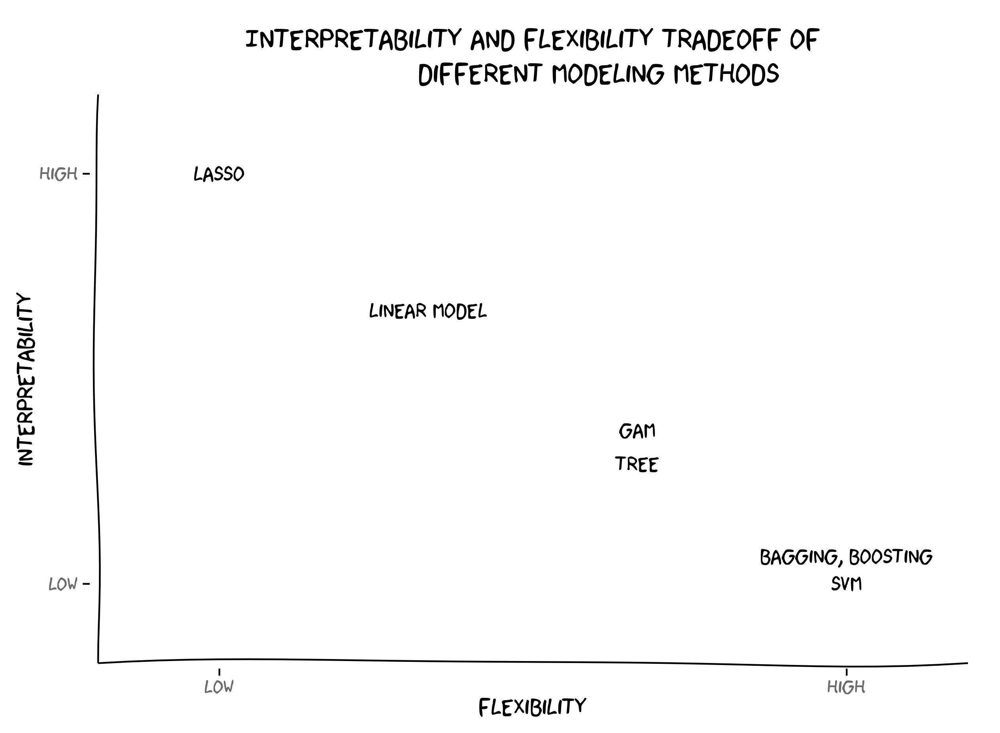

# Chapter 2 - Statistical Learning
# Overview

There are 2 types of statistical learning: _supervised_ and _unsupervised_.

> * **Supervised learning** is when you have a label for each data point, which mean it involves building a model that can predict an _output_ based on one or more _inputs_.
> * **Unsupervised learning** is when you don't have a label for each data point, where there are _inputs_ but no supervising _output_.

In statistical learning, _**input variables**_ $$(X_{n})$$ are typically denoted by _features_, _predictors_, _indepedent variables_ or _variables_ while _**output variable**_ $$(Y)$$ often called _dependent variable_ or _response_. 

To assess the relationship between predictors $$X_{1}, X_{2}, ...,X_{p}$$, we have the equation as following:

$$\Large Y=f(X)%2B\epsilon$$ 

Whereas:

$$
MSE = \frac{1}{n}\sum_{i = 1}^{n} (y_{n} - \hat{f}(x_{i})^2,
$$

* $$f$$ is fixed but unknown function of $$X_{1},...,X_{p}$$  and $$\epsilon$$ is a random _error term_, which is independent of $$X$$ and has mean zero.

In essence, statistical learning refers to a set of approaches for estimating $$f$$.

---

## Why Estimate f?

There are 2 main reasons: **_prediction_** and **_inference_**.

### Prediction

Hypothetically, let's say we have the **_error term_** averages to 0, predicting $$Y$$ can be assessed using this equation:

$$\hat{Y} = \Large \hat{f}(X)$$

Whereas:

* $$\hat{f}$$ represents the estimate for $$f$$
* $$\hat{Y}$$ represents the resulting predcition for $$Y$$

The accuracy of $$\hat{Y}$$ as a prediction for $$Y$$ depends on 2 quantities: **_reducible error_** and **_irriducible error_**.

> * **_reducible error_**: Reducible error is the error arising from the mismatch between $$\hat{f}$$ and $$f$$. Can be improved by choosing a better model. Usually caused by [Variance Error](#variance-error)/[Bias Error](#bias-error).
> * **_irriducible error_**: Errors which can't be removed no matter what algorithm you apply. These errors are caused by unknown variables that are affecting the independent/output variable but are not one of the dependent/input variable while designing the model. 

### Inference

Neccessary questions need to be asked in order to further understand the relationship between predictors $$(X_{n})$$ and outcome $$(Y)$$:

* **_Which predictors are associated with response?_** Only a small fraction of the available predictors are associated with the response.
* **_What is the relationship between predictors and response?_** The relationship between predictors and response is not always linear.
* **_Can the relationship between predictors and response be explained by the linear model or it is more complicated?_** The model can explain the relationship between predictors and response if the model is able to predict the response based on the predictors.


Important info: this note needs to be highlighted


---

## How Do We Estimate f?

In order to estimate $$f$$, our goal is to apply a statistical learning method to the training data. Broadly speaking, most statistical learning methods for this task can be characterized as either **_parametric_** or **_non-parametric_**.

### Parametric Methods

Parametric methods (model-based approach) are those that are able to estimate the parameters of the model based on the training data. It involves a **two-step model-based approach**:

1. First, we make an assumption about the functional form, or shape, of $$f$$. In other words, we need to choose the model that best fits the data.
2. After the model has been selected, we need a procedure that uses the training data to _fit_ or _train_ the model.

Potential disadvantages of parametric methods is that the model will not usually match the true $$f$$. This can be avoid by choosing a more _flexible_ models that can fit many possible functions for $$f$$ forms and usually require greater number of parameters.

Example fitting models for parametric methods (linear): Odirnary Least Squares (OLS), Lasso.

### Non-Parametric Methods

Non-parametric methods (model-free approach) seek an estimate of $$f$$ without make explicit assumptions about the functional form of of $$f$$. Major disadvantages of this approach is that a very large number of observations is required in order to obtain an accurate estimate for $$f$$.


Example fitting models for non-parametric methods: _smooth thin-plate spline fit_ and _rough thin-plate spline fit_.


---

## The Tradeoff Between Prediction Accuracy and Model Interpretability

Figure 1 illustrates the tradeoff between flexibility and interpretability of using different statistical learning methods. In general, as the flexibility increase, the interpretability decreases.

**Why would we ever choose to use a more restrictive method instead of a very flexible approach?** If we are mainly interested in the interpretability of the model, we would rather use a more flexible model. This is because the flexibility of the model is usually better than the interpretability of the model. In contrast, if we are interested in the prediction accuracy of the model, we would rather use a more restrictive model. This is because the flexibility of the model is usually better than the prediction accuracy of the model.

---

## Supervised Vs. Unsupervised Learning

Most statistical learning problems involve both supervised and unsupervised learning.

In supervised learning, we wish to fit a model to the training data and predict the response variable based on the predictors, with the aim of accurately predicting the response variable or better understanding the relationship between predictors and response variable. 

Some of the statistical approaches that apply the supervised learning method are:
* **Linear Regression**
* **Logistic Regression**
* **Boosting & Support Vector Machine**
* **Generalized Additive Models (GAMs)**

In contrast, unsupervised learning methods are those that do not require any training data. One statistical learning tool that we may use in this setting is _cluster analysis_ or clustering. The goal of this method is to ascertain, whether observations fall into distinct groups.

---

## Regression Vs. Classification

Variables can be characterized as either **_quantitative_** or **_qualitative_**. Quantitative variables are those that can be measured in terms of a number. Qualitative variables are those that can be measured in terms of a set of categories.

We tend to to refer to problems with a quantitative response variable as **regression** problems and problems with a qualitative response variable as **classification** problems. We tend to select statistical learning methods based on the variable types (quantitative or qualitative). However, an important note is that it does not matter much whether the predictors/variables are quantitative or qualitative.

# Assessing Model Accuracy

_There is no free lunch in statistics_: no one method dominates all others over all possible data sets. This section introduce some common ways to assess the accuracy of a model to select a statistical learning procedure for a specific data set.

## The Reression Setting

### Measuring the Quality of fit

In order to evaluate the performance of a model, we need to measure how well its predictions actually match the observed data. In the regression setting, the most commonly used measure is the **mean squared error (MSE)**:

$$\Large MSE = \frac{1}{n}\sum_{i = 1}^{n} (y_{n} - \hat{f}(x_{i})^2$$

given by where $$\hat{f}(x_{i}$$ is the prediction that $$\hat{f}$$ gives for the ith observations. 

The MSE will be small if the predicted responses are very close to the true response, and will be large if for some observations, the predicted and true responses differ substantially.

* **_training MSE_**: The MSE is computed using the training data that was used to fit the model.

* **_test MSE_**: The MSE is computed using the previously unseen test observation not used to train the statistical learning method.

When a given method yields a small training MSE but a large test MSE, we are said to be _overfitting_ the data. When we overfit the training data, the test MSE will be very large because the supposed patterns  that the method found in the training data simply don't exist in the test data.

### The Bias-Variance Trade-Off

#### **Variance Error**

> **Variance** is the amount that the estimate of $$\hat{f}$$ will change if different training data was used. 
   
Ideally, it should not change too much from one training dataset to the next, meaning that the algorithm is good at picking out the hidden underlying mapping between the inputs and the output variables.

Examples of low-variance machine learning algorithms include: Linear Regression, Linear Discriminant Analysis and Logistic Regression.

Examples of high-variance machine learning algorithms include: Decision Trees, k-Nearest Neighbors and Support Vector Machines.

#### **Bias Error**

**Bias** are the simplifying assumptions made by a model to make the target function easier to learn.

Generally, linear algorithms have a high bias making them fast to learn and easier to understand but generally less flexible. In turn, they have lower predictive performance on complex problems that fail to meet the simplifying assumptions of the algorithms bias.

* **Low Bias:** Suggests less assumptions about the form of the target function.
* **High-Bias:** Suggests more assumptions about the form of the target function.

Examples of low-bias machine learning algorithms include: Decision Trees, k-Nearest Neighbors and Support Vector Machines.

Examples of high-bias machine learning algorithms include: Linear Regression, Linear Discriminant Analysis and Logistic Regression.

#### **Bias-Variance Trafe-Off**

The goal of any supervised machine learning algorithm is to achieve *low bias* and *low variance*. In turn the algorithm should achieve good prediction performance.

You can see a general trend in the examples above:

* **Linear machine learning algorithms** often have a high bias but a low variance.
* **Nonlinear machine learning algorithms** often have a low bias but a high variance.
* The parameterization of machine learning algorithms is often a battle to balance out bias and variance.

---

## The Classification Setting

The most common approach for quantifying the accuracy of our estimate $$\hat{f}$$ is the _training error__ rate, the proportion of mistakes that are made if we apply our estimate $$\hat{f}$$ to the training observations:

$$\Large \frac{1}{n}\sum_{i = 1}^{n} I (y_{i} \neq \hat{y_{i}})$$

Whereas:

* $$\hat{y_{i}}$$: the predicted class label for the ith observation using $$\hat{f}$$
* $$I (y_{i} \neq \hat{y_{i}})$$: an _indicator variable_ that equal **1** if $$y_{i} \neq \hat{y_{i}}$$ and **0** if $$y_{i} = \hat{y_{i}}$$. If:
  
  *  $$I (y_{i} \neq \hat{y_{i}}) = 0$$: correct classification
  *  $$I (y_{i} \neq \hat{y_{i}}) \neq 0$$: incorrect classification (misclassified)

A good classifier is one for which the _test error_ is smallest where the _test error_ rate associated with a set of test observations of the from $$(x_{0}, y_{0})$$.

---

### The Bayes Classifier

This algorithm is called Naïve because it works on the naïve assumption that the features are independent. Naïve Bayes Classifier works with principle of Bayes Theorem. 

> Conditional probability of an event $$A$$ given $$B$$, $$P(A|B)$$ is the probability of $$A$$ given that $$B$$ has already occurred. It is often defined as the ratio of joint probability of $$A$$ and $$B$$ (probability of $$A$$ and $$B$$ occurring together) to the marginal probability of $$A$$ (probability of event $$A$$)

**Pros**

* Easy to implement
* Performs reasonably well with noisy data

**Cons**

* Poor performance with continuous features
* Assumption that features are independent is risky

---

### K-Nearest Neighbors (KNN)

K-Nearest neighbors algorithm can be used to solve both classification and regression problems. When algorithms such as Naïve Bayes Classifier uses probabilities from training samples for predictions, KNN is Lazy learner that does not create any model in advance. The just find the closest based on feature similarity.

**Pros**

* Easy to implement
* No assumptions involved

**Cons**

* Optimal K is always a challenge
* Lazy learner- computationally expensive

