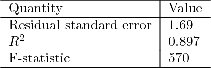
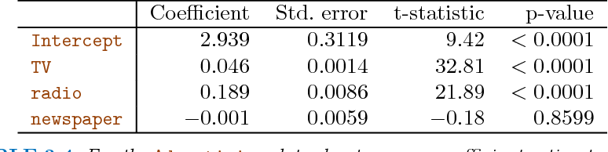
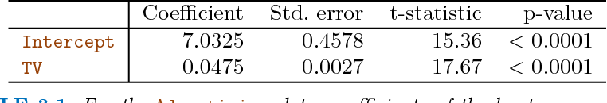
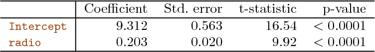

# Case Study - Marketing Plan

## Data Overview

The `Advertising` data set consists of the sales of that product in 200 different markets, along with advertising budgets for the product in each of those markets for three different media: `TV`, `radio`, and `newspaper`. The data are displayed in Figure 2.1. 

The plot displays sales, in thousands of units, as a function of `TV`, `radio`, and `newspaper` budgets, in thousands of dollars, for 200 different markets. In each plot we show the simple least squares fit of sales to that variable, as described in Chapter 3. In other words, each blue line represents a simple model that can be used to predict sales using `TV`, `radio`, and newspaper`, respectively. 

---

## Important Questions

Suppose that in our role as statistical consultants we are asked to suggest, on the basis of this data, a marketing plan for next year that will result in high product sales. Here are a few important questions that we might seek to address:

1. *Is there a relationship between advertising sales and budget?*

This question can be answered by fitting a multiple regression model
of sales onto `TV`, `radio`, and `newspaper`, as:

$$
sales = \beta_0 + \beta_1 × TV + \beta_2 × radio + \beta_3 × newspaper + \epsilon.
$$

and testing the hypothesis 
$$
\Large H_0: \beta_{TV} = \beta_{radio} = \beta_{newspaper} = 0
$$
 
F-statistic can be used to determine whether or not we should reject this null hypothesis. In this case, the p-value corresponding to the F-statistic in Table 3.6 is very low, indicating clear evidence of a relationship between advertising and sales.

2. *How strong is the relationship?*

First, the RSE estimates the standard deviation of the response from the
population regression line. For the `Advertising` data, the RSE is $$1,681$$ units while the mean value for the response is $$14,022$$, indicating a percentage error of roughly $$12%$$. Second, the $$R^2$$ statistic records the percentage of variability in the response that is explained by the predictors. The predictors explain almost $$90%$$ of the variance in sales. The RSE and $$R^2$$ statistics are displayed in Table 3.6.

3. *Which media contribute to sales?*

To answer this question, we can examine the p-values associated with each predictor’s t-statistic. In the multiple linear regression displayed in Table 3.4, the p-values for `TV` and `radio` are low, but the p-value for `newspaper` is not. This suggests that only `TV` and `radio` are related to sales.

4. *How large is the effect of each medium on sales?*

The standard error of $$\hat{\beta_j}$$ can be used to construct confidence intervals for $$\beta_j$$. For the `Advertising` data, the 95% confidence intervals are as follows: $$(0.043, 0.049)$$ for `TV`, $$(0.172, 0.206)$$ for `radio`, and $$(−0.013, 0.011)$$ for `newspaper`. 

The confidence intervals for `TV` and `radio` are narrow and far from zero, providing evidence that these media are related to sales. But the interval for `newspaper` includes zero, indicating that the variable is not statistically significant given the values of `TV` and `radio`.

We saw in previous section that collinearity can result in very wide standard errors.


***Could collinearity be the reason that the confidence interval associated with newspaper is so wide?*** 

The VIF scores are $$1.005$$, $$1.145$$, and $$1.145$$ for `TV`,`radio`, and `newspaper`, suggesting no evidence of collinearity.


In order to assess the association of each medium individually on sales, we can perform three separate simple linear regressions. Results are shown in Tables 3.1 and 3.3. 

Coefficients of the least squares model for the regression of number of units sold on `TV` advertising budget. An increase of $1,000 in the `TV` advertising budget is associated with an increase in sales by around 50 units.

Coefficients of the simple linear regression model for number of units sold on:
* **Top:** `radio` advertising budget.
* **Bottom:** `newspaper` advertising budget. 

A $1,000 increase in spending on `radio` advertising is associated with an average increase in sales by around 203 units, while the same increase in spending on `newspaper` advertising is associated with an average increase in sales by around 55 units.

There is evidence of an extremely strong association between `TV` and `sales` and between `radio` and `sales`. There is evidence of a mild association between `newspaper` and `sales`, when the values of `TV` and `radio` are ignored.

5. *How accurately can we predict future sales?*

The response can be predicted using:

$$
y = \hat{\beta_0} + \hat{\beta_1}x_1 + \hat{\beta_2}x_2 + · · · + \hat{\beta_0}x_p.
$$

The accuracy associated with this estimate depends on whether we wish to predict an individual response, $$Y = f(X) + \epsilon$$, or the average response, $$f(X)$$. If the former, we use a prediction interval, and if the latter, we use a confidence interval. Prediction intervals will always be wider than confidence intervals because they account for the uncertainty associated with $$\epsilon$$, the irreducible error.

6. *Is the relationship linear?*

In previous section, we saw that residual plots can be used in order to
identify non-linearity. If the relationships are linear, then the residual plots should display no pattern. In the case of the `Advertising` data, we observe a non-linear effect in Figure 3.5, though this effect could also be observed in a residual plot. We also discussed the inclusion of transformations of the predictors in the linear regression model in order to accommodate non-linear relationships.

From the pattern of the residuals, we can see that there is a pronounced non-linear relationship in the data. The positive residuals (those visible above the surface), tend to lie along the 45-degree line, where `TV` and `radio` budgets are split evenly. The negative residuals (most not visible), tend to lie away from this line, where budgets are more lopsided.

7. *Is there synergy among the advertising media?*

The standard linear regression model assumes an additive relationship
between the predictors and the response. An additive model is easy to interpret because the effect of each predictor on the response is unrelated to the values of the other predictors. However, the additive assumption may be unrealistic for certain data sets. A small p-value associated with the interaction term indicates the presence of such relationships. 

Figure 3.5 suggested that the `Advertising` data may not be additive. Including an interaction term in the model results in a substantial increase in R2, from around $$90%$$ to almost $$97%$$.