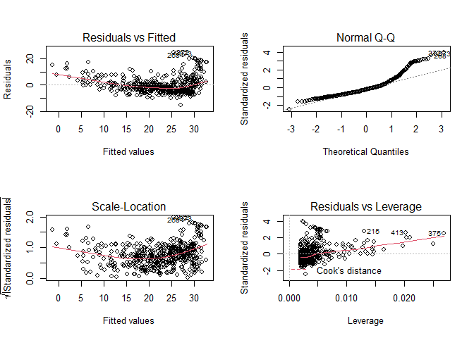

# Chapter 3 Lab: Linear Regression

``` r
library(MASS)
library(ISLR)
```

# Simple Linear Regression

The Boston data set records `medv` (median house value) for 506
neighborhoods around Boston. We will seek to predict `medv` using 13
predictors such as `rm` (average number of rooms per house), `age`
(average age of houses), and `lstat` (percent of households with low
socioeconomic status).

``` r
fix(Boston)
names(Boston)
```

    ##  [1] "crim"    "zn"      "indus"   "chas"    "nox"     "rm"      "age"    
    ##  [8] "dis"     "rad"     "tax"     "ptratio" "black"   "lstat"   "medv"

We will start by using the `lm()` function to fit a simple linear
regression `lm()` model, with `medv` as the response and `lstat` as the
predictor.

``` r
lm.fit=lm(medv~lstat,Boston)
lm.fit
```

    ## 
    ## Call:
    ## lm(formula = medv ~ lstat, data = Boston)
    ## 
    ## Coefficients:
    ## (Intercept)        lstat  
    ##       34.55        -0.95

For more detailed information, we use `summary(lm.fit)`. This gives us
p-values and standard errors for the coefficients, as well as the
*R*<sup>2</sup>
statistic and F-statistic for the model.

``` r
summary(lm.fit)
```

    ## 
    ## Call:
    ## lm(formula = medv ~ lstat, data = Boston)
    ## 
    ## Residuals:
    ##     Min      1Q  Median      3Q     Max 
    ## -15.168  -3.990  -1.318   2.034  24.500 
    ## 
    ## Coefficients:
    ##             Estimate Std. Error t value Pr(>|t|)    
    ## (Intercept) 34.55384    0.56263   61.41   <2e-16 ***
    ## lstat       -0.95005    0.03873  -24.53   <2e-16 ***
    ## ---
    ## Signif. codes:  0 '***' 0.001 '**' 0.01 '*' 0.05 '.' 0.1 ' ' 1
    ## 
    ## Residual standard error: 6.216 on 504 degrees of freedom
    ## Multiple R-squared:  0.5441, Adjusted R-squared:  0.5432 
    ## F-statistic: 601.6 on 1 and 504 DF,  p-value: < 2.2e-16

We can use `names()` function in oeder to find out what other pieces of
information are store in `lm.fit`.

``` r
names(lm.fit)
```

    ##  [1] "coefficients"  "residuals"     "effects"       "rank"         
    ##  [5] "fitted.values" "assign"        "qr"            "df.residual"  
    ##  [9] "xlevels"       "call"          "terms"         "model"

Assessing the coefficient of the model:

``` r
coef(lm.fit)
```

    ## (Intercept)       lstat 
    ##  34.5538409  -0.9500494

Assessing the confidence interval for the coefficient estimates:

``` r
confint(lm.fit)
```

    ##                 2.5 %     97.5 %
    ## (Intercept) 33.448457 35.6592247
    ## lstat       -1.026148 -0.8739505

To produce confidence interval an prediction intervals for the
prediction of `medv` for a given value of `lstat`.

``` r
predict(lm.fit,data.frame(lstat=(c(5,10,15))), interval="confidence")
```

    ##        fit      lwr      upr
    ## 1 29.80359 29.00741 30.59978
    ## 2 25.05335 24.47413 25.63256
    ## 3 20.30310 19.73159 20.87461

``` r
predict(lm.fit,data.frame(lstat=(c(5,10,15))), interval="prediction")
```

    ##        fit       lwr      upr
    ## 1 29.80359 17.565675 42.04151
    ## 2 25.05335 12.827626 37.27907
    ## 3 20.30310  8.077742 32.52846

We will now plot `medv` and `lstat` along with the least squares
regression line using the `plot()` and `abline()` functions.

``` r
attach(Boston)
plot(lstat,medv)
abline(lm.fit)
```


Next we examine some diagnostic plots, several of which were discussed.
Four diagnostic plots are automatically produced by applying the
`plot()` function directly to the output from `lm()`.

``` r
par(mfrow=c(2,2))
plot(lm.fit)
```



``` r
plot(predict(lm.fit), residuals(lm.fit))
```


Alternatively, we can compute the residuals from a linear regression fit
using the `residuals()` function. The function `rstudent()` will return
the studentized residuals, and we can use this function to plot the
residuals against the fitted values.

``` r
plot(predict(lm.fit), rstudent(lm.fit))
```


On the basis of the residual plots, there is some evidence of
non-linearity. Leverage statistics can be computed for any number of
predictors using the `hatvalues()` function.

``` r
plot(hatvalues(lm.fit))
```


The `which.max()` function identifies the index of the largest element
of a `which.max()` vector. In this case, it tells us which observation
has the largest leverage statistic.

``` r
which.max(hatvalues(lm.fit))
```

    ## 375 
    ## 375

## Multiple Linear Regression


lm.fit=lm(medv\~lstat+age,data=Boston) summary(lm.fit)
lm.fit=lm(medv\~.,data=Boston) summary(lm.fit) library(car) vif(lm.fit)
lm.fit1=lm(medv\~.-age,data=Boston) summary(lm.fit1)
lm.fit1=update(lm.fit, \~.-age)

# Interaction Terms

summary(lm(medv\~lstat\*age,data=Boston))

# Non-linear Transformations of the Predictors

lm.fit2=lm(medv\~lstat+I(lstat^2)) summary(lm.fit2)
lm.fit=lm(medv\~lstat) anova(lm.fit,lm.fit2) par(mfrow=c(2,2))
plot(lm.fit2) lm.fit5=lm(medv\~poly(lstat,5)) summary(lm.fit5)
summary(lm(medv\~log(rm),data=Boston))

# Qualitative Predictors

fix(Carseats) names(Carseats)
lm.fit=lm(Sales\~.+Income:Advertising+Price:Age,data=Carseats)
summary(lm.fit) attach(Carseats) contrasts(ShelveLoc)

# Writing Functions

LoadLibraries LoadLibraries() LoadLibraries=function(){ library(ISLR)
library(MASS) print(“The libraries have been loaded.”) } LoadLibraries
LoadLibraries()
