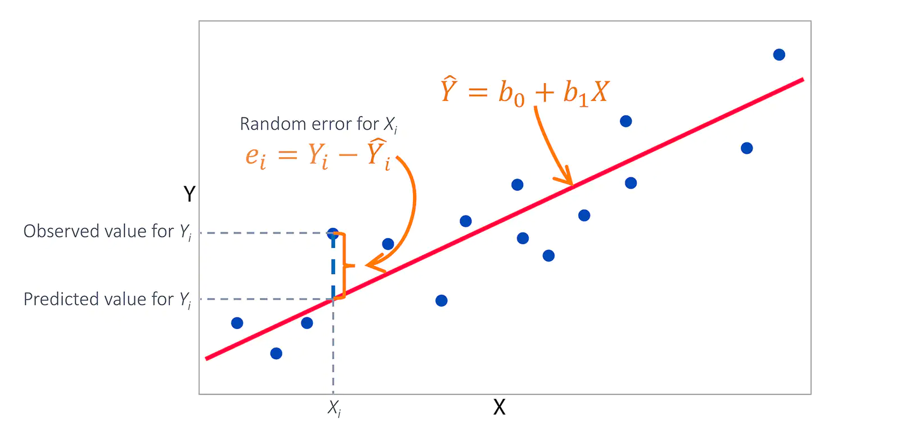
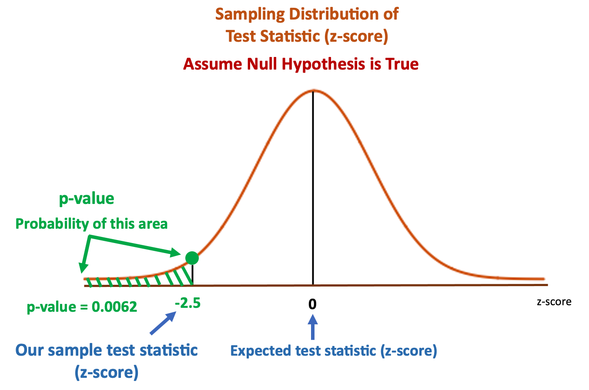

# Simple Linear Regression

***Simple linear regression*** is a very straightforward approach for predicting a qualitative response $$Y$$ on the basis of a single predictor $$X$$. Mathematically, we can write this linear relationship as

$$
\Large Y \approx \beta_0 + \beta_1 X
$$

Whereas:

* $$\beta_0$$: intercept
* $$\beta_1$$: slope

## Estimating the Coefficients
In practice, $$\beta_0$$ and $$\beta_1$$ are unknown. So before make predictions, we must use data to estimate the coefficients. Let

$$
\Large (x_1, Y_1), (x_2, Y_2),...,(x_n, Y_n)
$$
represent $$n$$ observation pairs, each of which consists of a measurement of $$X$$ and a measurement of $$Y$$. Our goal is to obtain coefficient estimates $$\beta_0$$ and $$\beta_1$$ such that the linear model fits the available data well. In other words, we want to find an intercept $$\beta_0$$ and a slope $$\beta_1$$ such that the resulting line is as close as possible to the $$n$$ data points.

There are numbers of ways of measuring *closeness*. However, by far the most common approach involves minimizing the *least squares* criterion, and we take that approach in this chapter.

---

## The Least Square Approach

Let Y_i = \beta_0 + \beta_1 X_i  be the prediction for $$Y$$ based on the $$i$$th value of $$X$$. Then $$e_i = y_i -\hat{y}+i$$ represents the $$i$$th *residual* - this is the difference between the $$i$$th value and the $$i$$th reponse value that is predicted by our linear model. We define the *residual sum of square (RSS)* as

$$
\Large RSS = e_1^2 + e_2^2 + ... + e_n^2
$$

or equivalent as 
$$
\Large RSS = (y_1 - \hat{\beta_0} - \hat{\beta_1}x_2)^2 + (y_2 - \hat{\beta_0} - \hat{\beta_1}x_2)^2  + ... + (y_n - \hat{\beta_0} - \hat{\beta_1}x_n)^2
$$

***The least square approach*** chooses $$\hat{\beta_0}$$ and $$\hat{\beta_1}$$ to minimize the RSS.

---

## Assessing the Accuracy of the Coefficient Estimates
Population Regression Line:

$$
\Large Y=\beta_0 + \beta_1X + \epsilon
$$

where $$\epsilon$$ mean zero random error term

Least squares line :
$$
\Large \hat{y}=\hat{\beta_0} + \hat{\beta_1}X 
$$

(true relationship between X and Y takes the form $$Y=f(X)+\epsilon$$

Fundamentally, the concept of these two lines (population regression line vs. least squares line) is a natural extension of the standard statistical approach of using information from a sample to estimate characteristics of a large population. 

For example, suppose that we are interested in knowing the population mean $$\mu$$  of some random variable $$Y$$. Unfortunately, $$\mu$$ is unknown, but we do have access to $$n$$ observations from $$Y$$, which we can write as $$y_1$$, $$y_2$$, $$\cdots$$, $$y_n$$, and which we can use to estimate $$\mu$$. A reasonable estimate is $$\hat{\mu}$$ = $$\hat{y}, where \hat{y} = \dfrac {1}{n}\sum^n_{i=1}{y_i} is the sample mean.

The sample mean and the population mean are different, but in general the sample mean will provide a good estimate of the population mean. In the same way, the unknown coefficients $$\beta_0$$ and $$\beta_1$$ in linear regression define the population regression line. We seek to estimate these unknown coefficients using \hat{\beta_0} and \hat{\beta_1} given in the least square line formula above. These coefficient estimates define the least squares line.

The analogy between linear regression and estimation of the mean of a random variable is an apt one based on the concept of bias. If we use the sample mean $$\hat{\mu}$$ to estimate $$\mu$$, this estimate is unbiased, in the sense that on average, we expect $$\hat{\mu}$$ to equal $$\mu$$.

In other words, if we estimate $$\beta_0$$ and $$\beta_1$$ on the basis of a particular data set, then our estimates won’t be exactly equal to $$\beta_0$$ and $$\beta_1$$. But if we could average the estimates obtained over a huge number of data sets, then the average of these estimates would be spot on! 

In fact, we can see from the right-hand panel of Figure 3.3 that the average of many least squares lines, each estimated from a separate data set, is pretty close to the true population regression line.

* **Left:** The red line represents the true relationship, $$f(X) = 2+3Xf(X)=2+3X$$, which is known as the population regression line. The blue line is the least squares line; it is the least squares estimate for $$f(X)$$ based on the observed data, shown in black. 
* **Right:** The population regression line is again shown in red, and the least squares line in dark blue. In light blue, ten least squares lines are shown, each computed on the basis of a separate random set of observations. Each least squares line is different, but on average, the least squares lines are quite close to the population regression line.

### **How Accurate Is The Sample Mean $$\hat{\mu}$$ As An Estimate Of Population Mean $$\mu$$**

We answer this question by computing the ***standard error*** of$$\mu$$, written as SE($$\hat{\mu}$$).

Standard errors ca also be used to perform ***hypothesis tests*** on the coefficients. The most common hypothesis test involves testing the ***null hypothesis*** of 

* $$H_0$$: There is no relationship between $$X$$ and $$Y$$
* $$H_a$$: There is some relationship between $$X$$ and $$Y$$

Mathematically, this corresponds to testing

$$
\Large H_0: \beta_1 = 0
$$

versus
$$
\Large H_1: \beta_1 \neq 0
$$

If $$\beta_1 = 0$$ then the model reduces to $$Y=\beta_0+\epsilon$$, and $$X$$ is not associated with $$Y$$.

To test the null hypothesis, we need to determine whether $$\hat{\beta_1}$$, our estimate for $$\beta_1, is sufficiently far from zero that we can be confident that $$\beta_1$$ is non-zero. 
 
### **How far is far enough?** 

This is course depends on the accuracy of $$\hat{\beta_1}$$ -that is, it depends on $$SE(\hat{\beta_1})$$. If SE($$\hat{\beta_1}$$) is small, then even relatively small values of $$\hat{\beta_1}$$ may provide strong evidence that $$\beta_1 \neq 0$$​, and hence that there is a relationship between $$X$$ and $$Y$$. In contrast, if SE($$\hat{\beta_1}$$) is large, then $$\hat{\beta_1}$$ must be large in absolute value in order for us to reject the null hypothesis. 

---

## T-distribution 

**The t-distribution** describes the standardized distances of sample means to the population mean when the population standard deviation is not known, and the observations come from a normally distributed population.

In practice, we compute a ***t-statistic***, given by
$$
\Large t=\dfrac{\hat{\beta_1}-0}{SE(\hat{\beta_1})}
$$

For example, we have a t-distribution with $$n-2$$ degrees of freedom as in Figure 3.3.

The t-distribution has a bell shape and for values of n greater than approximately 30 it is quite similar to the normal distribution. Consequently, it is a simple matter to compute probability of observing any value equal to $$|t|$$ or larger, assuming $$\beta_1 =0$$. We call this probability the ***p-value***.

$$
\Large P(|T| > t) = p
$$

Roughly speaking, we interpret the ***p-value*** as follows: 

If we see a small p-value, then we can infer that there is an association between the predictor and the response. We reject the null hypothesis-that is, we declare a relationship to exist between X and Y- if the p-value is small enough.

Typical p-value cutoffs for rejecting the null hypothesis are 5 or 1 %. When n = 30, these corresponds to t-statistics of around 2 and 2.75, respectively.

## Assessing the Accuracy of the Model

After we have rejected the null hypothesis, t is natural to want to quantify the *extend of the model fits the data*.

The quality of a linear regression fit is typically assessed using 2 related quantities: the *residual standard error* and the $$R^2$$ statistic.

### Residual Standard Error
The RSE is an estimation of the standard deviation of $$\epsilon$$. Roughly speaking, it is the average amount that the response will deviate from the true regression line. It is computed using the formula:

$$
RSE=\sqrt{\frac{1}{n-2}} RSS= \sqrt{\frac{1}{n-2} {\sum_{i=1}^n (y_{i} - \hat{y_1})^{2}}}
$$

The RSE is considered a measure of the *lack of fit* of the model to the data:

* If RSE is small, we can conclude that the model fits the data very well.

* In contrast, if RSE is large, it indicates that the model doesn't fit the data well.


One consideration of RSE is it is the measure in the units of $$Y$$ and thus, the method is not always clear what constitute a good RSE.

### $$R^2$$ Standard Error

The $$R^2$$ statistic takes the form of a *proportion*-the proportion of variance explained-and so it always takes on a value between 0 and 1, and is independent of the scale of $$Y$$. To calculate $$R^2$$, we use the formula:

$$
R^2 = \frac{TSS}{TSS−RSS}=1−\frac{TSS}{RSS}
$$

Whereas:

* **TSS**: total sum of square.
* **RSS**: measures the amount of variability that is left unexplained after performing the regression.

In terms of evaluating the $$R^2$$ statistic result:

* $$R^2$$ statistic close to 1 - the model fits well.
* $$R^2$$ statistic close to 0 - the model does not fit well.

---

## Consideration

> **Simple linear regression** is a useful approach for predicting a response on the basis of a single predictor variable. However, in practice we often have more than one predictor. 
> 
> The solution for this is to use another linear regression named as **Multiple Linear Regression**, which will be discussed in the next section.