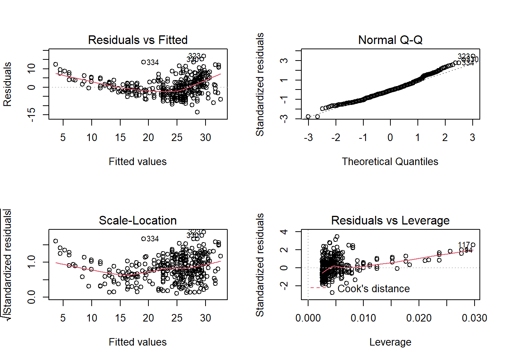
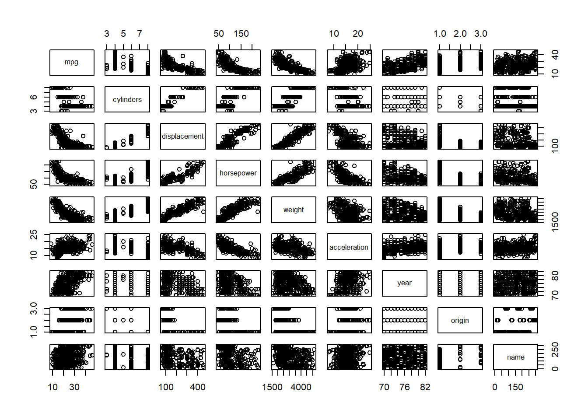
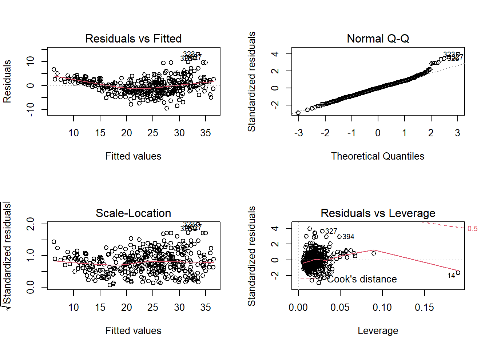

# Exercises (Applied)


## Question 1 {-}

This question involves the use of simple linear regression on the `Auto` data set.

### (a) Use the `lm()` function to perform a simple linear regression with `mpg` as the response and `horsepower` as the predictor. Use the `summary()` function to print the results. Comment on the output. {-}


```r
mpg.fit <- lm(mpg ~ horsepower, data = Auto)
summary(mpg.fit)
```

```
## 
## Call:
## lm(formula = mpg ~ horsepower, data = Auto)
## 
## Residuals:
##      Min       1Q   Median       3Q      Max 
## -13.5710  -3.2592  -0.3435   2.7630  16.9240 
## 
## Coefficients:
##              Estimate Std. Error t value Pr(>|t|)    
## (Intercept) 39.935861   0.717499   55.66   <2e-16 ***
## horsepower  -0.157845   0.006446  -24.49   <2e-16 ***
## ---
## Signif. codes:  0 '***' 0.001 '**' 0.01 '*' 0.05 '.' 0.1 ' ' 1
## 
## Residual standard error: 4.906 on 390 degrees of freedom
## Multiple R-squared:  0.6059,	Adjusted R-squared:  0.6049 
## F-statistic: 599.7 on 1 and 390 DF,  p-value: < 2.2e-16
```

In order to interpret the result, a set of following questions are set up to better investigate the model:

#### i. *Is there a relationship between the predictor and the response?* {-}

This question can be answered by fitting the simple linear regression model of `mpg` on `horsepower` and testing the null hypothesis:

:::formula
$$
H_0: \beta_j = 0
$$ 

:::

The p-value for the `horsepower` variable is very small (<<0.05), so there is strong evidence to believe that `horsepower` is associated with `mpg`. Therefore, there is a relationship between the predictor and response.

#### ii. *How strong is the relationship between the predictor and the response?* {-}

There are 2 measures of model accuracy to evaluate the degree of relationship between the predictor and the response, which are: **RSE** and $R^2$ **statistic**.

For the `Auto` data, the RSE is:


```r
summary(mpg.fit)$sigma
```

```
## [1] 4.905757
```
The RSE is different (good or bad) in the sense that it takes on the units of y, but we can divide this by mean y to get the **percentage error**:


```r
summary(mpg.fit)$sigma/mean(Auto$mpg)
```

```
## [1] 0.2092371
```
So the percentage error = 20.92%.

Second, the $R^2$ of the linear model, which can be thought of as “the percentage of variability in the response that is explained by the predictor”, is given by:


```r
summary(mpg.fit)$r.squared
```

```
## [1] 0.6059483
```
So the `horsepower` explains 60.59% of the variance in `mpg`.

#### iii. *Is the relationship between the predictor and the response positive or negative?* {-}


```r
coefficients(mpg.fit)
```

```
## (Intercept)  horsepower 
##  39.9358610  -0.1578447
```

The relationship is negative between `mpg` and `horsepower` as the coefficient estimate is -0.1578447.

#### iv. *What is the predicted `mpg` associated with a `horsepower` of 98? What are the associated 95% confidence and prediction intervals?* {-}

The confidence interval:

```r
predict(mpg.fit, data.frame(horsepower = 98), interval = "confidence", level = 0.95)
```

```
##        fit      lwr      upr
## 1 24.46708 23.97308 24.96108
```
The prediction interval:

```r
predict(mpg.fit, data.frame(horsepower = 98), interval = "prediction", level = 0.95)
```

```
##        fit     lwr      upr
## 1 24.46708 14.8094 34.12476
```
The prediction interval is wider than the confidence interval as we would expect.

### (b) Plot the response and the predictor. Use the `abline()` function to display the least squares regression line. {-}


```r
plot(Auto$horsepower,Auto$mpg,xlab = "horsepower", ylab = "mpg",main = "Scatterplot of mpg vs. horsepower")
abline(mpg.fit,col="red")
```


### (c) Use the `plot()` function to produce diagnostic plots of the least squares regression fit. Comment on any problems you see with the fit. {-}


```r
par(mfrow=c(2,2))
plot(mpg.fit)
```



The diagnostic plots show residuals in four different ways. Let’s take a look at the first type of plot:

####  **(i) Residuals vs Fitted** {-}

This plot shows if residuals have non-linear patterns.

In this case, The plot of residuals versus fitted values indicates the presence of non linearity in the data.

#### **(ii) Normal Q-Q** {-}

This plot shows if residuals are normally distributed. Do residuals follow a straight line well or do they deviate severely? It’s good to see that residuals in this model are lined well on the straight dashed line.


#### **(iii) Scale-Location** {-}

This plot show how you can check the assumption of equal variance (homoscedasticity).

In this case, there also appears to be non-constant variance in the error terms (heteroscedasticity), but this could be corrected to an extent when trying a quadratic fit. If not, transformations such as $log(y)$ or $\sqrt{y}$ can shrink larger responses by a greater amount and reduce this issue.

#### **(iv) Residuals vs Leverage** {-}

This plot helps us to find influential cases (i.e., subjects) if any. 

The plot of standardized residuals versus leverage indicates the presence of a few outliers and a few high leverage points.


## Question 2 {-}

This question involves the use of multiple linear regression on the `Auto` data set.

### (a) Produce a scatterplot matrix which includes all of the variables in the data set. {-}


```r
pairs(Auto)
```



### (b) Compute the matrix of correlations between the variables using the function `cor()`. You will need to exclude the “name” variable, which is qualitative. {-}


```r
names(Auto)
```

```
## [1] "mpg"          "cylinders"    "displacement" "horsepower"   "weight"      
## [6] "acceleration" "year"         "origin"       "name"
```


```r
cor(Auto[-9])
```

```
##                     mpg  cylinders displacement horsepower     weight
## mpg           1.0000000 -0.7776175   -0.8051269 -0.7784268 -0.8322442
## cylinders    -0.7776175  1.0000000    0.9508233  0.8429834  0.8975273
## displacement -0.8051269  0.9508233    1.0000000  0.8972570  0.9329944
## horsepower   -0.7784268  0.8429834    0.8972570  1.0000000  0.8645377
## weight       -0.8322442  0.8975273    0.9329944  0.8645377  1.0000000
## acceleration  0.4233285 -0.5046834   -0.5438005 -0.6891955 -0.4168392
## year          0.5805410 -0.3456474   -0.3698552 -0.4163615 -0.3091199
## origin        0.5652088 -0.5689316   -0.6145351 -0.4551715 -0.5850054
##              acceleration       year     origin
## mpg             0.4233285  0.5805410  0.5652088
## cylinders      -0.5046834 -0.3456474 -0.5689316
## displacement   -0.5438005 -0.3698552 -0.6145351
## horsepower     -0.6891955 -0.4163615 -0.4551715
## weight         -0.4168392 -0.3091199 -0.5850054
## acceleration    1.0000000  0.2903161  0.2127458
## year            0.2903161  1.0000000  0.1815277
## origin          0.2127458  0.1815277  1.0000000
```

### (c) Use the `lm()` function to perform a multiple linear regression with `mpg` as the response and all other variables except “name” as the predictors. Use the `summary()` function to print the results. Comment on the output. {-}


```r
mpg.fit2 <- lm(mpg ~. -name, data=Auto)
summary(mpg.fit2)
```

```
## 
## Call:
## lm(formula = mpg ~ . - name, data = Auto)
## 
## Residuals:
##     Min      1Q  Median      3Q     Max 
## -9.5903 -2.1565 -0.1169  1.8690 13.0604 
## 
## Coefficients:
##                Estimate Std. Error t value Pr(>|t|)    
## (Intercept)  -17.218435   4.644294  -3.707  0.00024 ***
## cylinders     -0.493376   0.323282  -1.526  0.12780    
## displacement   0.019896   0.007515   2.647  0.00844 ** 
## horsepower    -0.016951   0.013787  -1.230  0.21963    
## weight        -0.006474   0.000652  -9.929  < 2e-16 ***
## acceleration   0.080576   0.098845   0.815  0.41548    
## year           0.750773   0.050973  14.729  < 2e-16 ***
## origin         1.426141   0.278136   5.127 4.67e-07 ***
## ---
## Signif. codes:  0 '***' 0.001 '**' 0.01 '*' 0.05 '.' 0.1 ' ' 1
## 
## Residual standard error: 3.328 on 384 degrees of freedom
## Multiple R-squared:  0.8215,	Adjusted R-squared:  0.8182 
## F-statistic: 252.4 on 7 and 384 DF,  p-value: < 2.2e-16
```

#### i. Is there a relationship between the predictors and the response? {-}

 We answer this question by performing an F-test, where we test the null hypothesis that all of the regression coefficients are zero:
 
$$
H_0:\beta_1=\beta_2=...=\beta_p=0\\

H_a: at \;least \;one \;\beta_j\neq0
$$

The p-value is given at the bottom of the model summary (`p-value: < 2.2e-16`), so it’s clear that the probability of the null hypothesis being true (given our data) is practically zero.

We reject the null hypothesis (and hence conclude that there is a relationship between the predictors and `mpg`).

#### ii. Which predictors appear to have a statistically significant relationship to the response? {-}

We can answer this question by checking the p-values associated with each predictor’s t-statistic. We may conclude that all predictors are statistically significant except `cylinders`, `horsepower` and `acceleration`.


#### iii. What does the coefficient for the `year` variable suggest? {-}


```r
coef(mpg.fit2)[7]
```

```
##      year 
## 0.7507727
```


The coefficient ot the `year` variable suggests that the average effect of an increase of 1 year is an increase of 0.7507727 in `mpg` (all other predictors remaining constant). In other words, cars become more fuel efficient every year by almost 1 mpg / year.

### (d) Use the `plot()` function to produce diagnostic plots of the linear regression fit. Comment on any problems you see with the fit. {-}


```r
par(mfrow=c(2,2))
plot(mpg.fit2)
```



#### **(i) Residuals vs Fitted** {-}

This plot shows if residuals have non-linear patterns.

In this case, The plot of residuals versus fitted values indicates the presence of mild non linearity in the data.

#### **(ii) Normal Q-Q** {-}

This plot shows if residuals are normally distributed. Do residuals follow a straight line well or do they deviate severely? It’s good to see that residuals in this model are lined well on the straight dashed line.


#### **(iii) Scale-Location** {-}

This plot show how you can check the assumption of equal variance (homoscedasticity).

In this case, there also appears to be non-constant variance in the error terms (heteroscedasticity), but this could be corrected to an extent when trying a quadratic fit. If not, transformations such as $log(y)$ or $\sqrt{y}$ can shrink larger responses by a greater amount and reduce this issue.

#### **(iv) Residuals vs Leverage** {-}

This plot helps us to find influential cases (i.e., subjects) if any. 

We can see some evidence of observations (e.g. 14) with both high leverage and high residual statistics, that may be disproportionately influencing the regression predictions.

### (e) Use the `*` and : symbols to fit linear regression models with interaction effects. Do any interactions appear to be statistically significant? {-}

Since we have relatively few predictors, we can test all interactions with `mpg ~ . * .` in the call to `lm()`:


```r
mpg.fit3 <- lm(mpg ~.* ., data=Auto[,-9]) 
summary(mpg.fit3)
```

```
## 
## Call:
## lm(formula = mpg ~ . * ., data = Auto[, -9])
## 
## Residuals:
##     Min      1Q  Median      3Q     Max 
## -7.6303 -1.4481  0.0596  1.2739 11.1386 
## 
## Coefficients:
##                             Estimate Std. Error t value Pr(>|t|)   
## (Intercept)                3.548e+01  5.314e+01   0.668  0.50475   
## cylinders                  6.989e+00  8.248e+00   0.847  0.39738   
## displacement              -4.785e-01  1.894e-01  -2.527  0.01192 * 
## horsepower                 5.034e-01  3.470e-01   1.451  0.14769   
## weight                     4.133e-03  1.759e-02   0.235  0.81442   
## acceleration              -5.859e+00  2.174e+00  -2.696  0.00735 **
## year                       6.974e-01  6.097e-01   1.144  0.25340   
## origin                    -2.090e+01  7.097e+00  -2.944  0.00345 **
## cylinders:displacement    -3.383e-03  6.455e-03  -0.524  0.60051   
## cylinders:horsepower       1.161e-02  2.420e-02   0.480  0.63157   
## cylinders:weight           3.575e-04  8.955e-04   0.399  0.69000   
## cylinders:acceleration     2.779e-01  1.664e-01   1.670  0.09584 . 
## cylinders:year            -1.741e-01  9.714e-02  -1.793  0.07389 . 
## cylinders:origin           4.022e-01  4.926e-01   0.816  0.41482   
## displacement:horsepower   -8.491e-05  2.885e-04  -0.294  0.76867   
## displacement:weight        2.472e-05  1.470e-05   1.682  0.09342 . 
## displacement:acceleration -3.479e-03  3.342e-03  -1.041  0.29853   
## displacement:year          5.934e-03  2.391e-03   2.482  0.01352 * 
## displacement:origin        2.398e-02  1.947e-02   1.232  0.21875   
## horsepower:weight         -1.968e-05  2.924e-05  -0.673  0.50124   
## horsepower:acceleration   -7.213e-03  3.719e-03  -1.939  0.05325 . 
## horsepower:year           -5.838e-03  3.938e-03  -1.482  0.13916   
## horsepower:origin          2.233e-03  2.930e-02   0.076  0.93931   
## weight:acceleration        2.346e-04  2.289e-04   1.025  0.30596   
## weight:year               -2.245e-04  2.127e-04  -1.056  0.29182   
## weight:origin             -5.789e-04  1.591e-03  -0.364  0.71623   
## acceleration:year          5.562e-02  2.558e-02   2.174  0.03033 * 
## acceleration:origin        4.583e-01  1.567e-01   2.926  0.00365 **
## year:origin                1.393e-01  7.399e-02   1.882  0.06062 . 
## ---
## Signif. codes:  0 '***' 0.001 '**' 0.01 '*' 0.05 '.' 0.1 ' ' 1
## 
## Residual standard error: 2.695 on 363 degrees of freedom
## Multiple R-squared:  0.8893,	Adjusted R-squared:  0.8808 
## F-statistic: 104.2 on 28 and 363 DF,  p-value: < 2.2e-16
```
We can see the significant terms (at the 0.05 level) are those with at least one asterisk (*). It is probably unreasonable to use a significance level of 0.05 here, as we are testing such a large number of hypothesis, perhaps a lower threshold for significance (or a p-value correction using the p.adjust() function) would be appropriate.

Using the standard threshold of 0.05, the significant interaction terms are given by:
* `displacement:year`
* `acceleration:year`
* `acceleration:origin`

### (f) Try a few different transformations of the variables, such as $log(X)$, $\sqrt{X}$, $X^2$. Comment on your findings. {-}


```r
par(mfrow = c(2, 2))
plot(log(Auto$horsepower), Auto$mpg, xlab= "log(horsepower)", ylab = "mpg", main="Log Tranformation")
plot(sqrt(Auto$horsepower), Auto$mpg, xlab= "sqrt(horsepower)", ylab = "mpg", main="Square Root Transformation")
plot((Auto$horsepower)^2, Auto$mpg, xlab= "horsepower", ylab = "mpg", main="X^2 Transformation")
```


We limit ourselves to examining `horsepower` as sole predictor. It seems that the log transformation gives the most linear looking plot.
