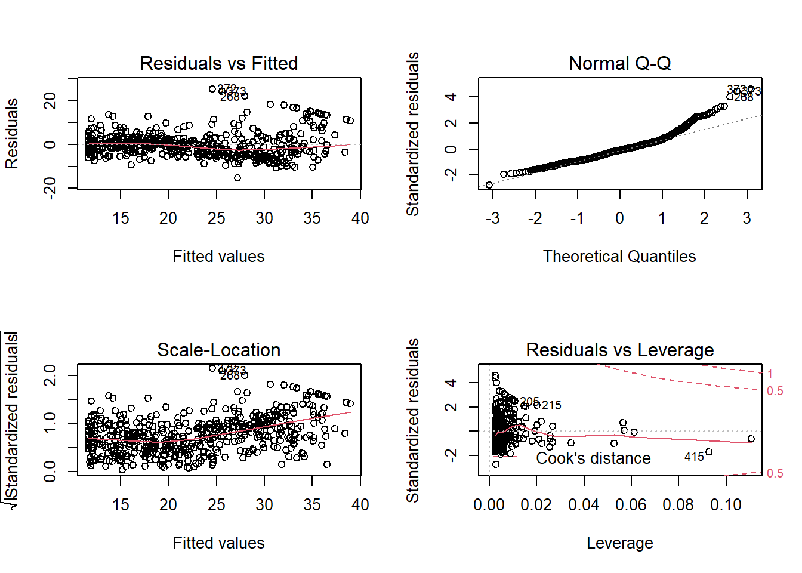

# Lab: Linear Regression


```r
# Load the library
library(MASS)
library(ISLR)
```

## Simple Linear Regression

The Boston data set records `medv` (median house value) for 506 neighborhoods around Boston. We will seek to predict `medv` using 13 predictors such as `rm` (average number of rooms per house), `age` (average age of houses), and `lstat` (percent of households with low socioeconomic status).


```r
fix(Boston)
names(Boston)
```

```
##  [1] "crim"    "zn"      "indus"   "chas"    "nox"     "rm"      "age"    
##  [8] "dis"     "rad"     "tax"     "ptratio" "black"   "lstat"   "medv"
```

We will start by using the `lm()` function to fit a simple linear regression `lm()` model, with `medv` as the response and `lstat` as the predictor.


```r
lm.fit=lm(medv~lstat,Boston)
lm.fit
```

```
## 
## Call:
## lm(formula = medv ~ lstat, data = Boston)
## 
## Coefficients:
## (Intercept)        lstat  
##       34.55        -0.95
```

For more detailed information, we use `summary(lm.fit)`. This gives us p-values and standard errors for the coefficients, as well as the $R^2$ statistic and F-statistic for the model.


```r
summary(lm.fit)
```

```
## 
## Call:
## lm(formula = medv ~ lstat, data = Boston)
## 
## Residuals:
##     Min      1Q  Median      3Q     Max 
## -15.168  -3.990  -1.318   2.034  24.500 
## 
## Coefficients:
##             Estimate Std. Error t value Pr(>|t|)    
## (Intercept) 34.55384    0.56263   61.41   <2e-16 ***
## lstat       -0.95005    0.03873  -24.53   <2e-16 ***
## ---
## Signif. codes:  0 '***' 0.001 '**' 0.01 '*' 0.05 '.' 0.1 ' ' 1
## 
## Residual standard error: 6.216 on 504 degrees of freedom
## Multiple R-squared:  0.5441,	Adjusted R-squared:  0.5432 
## F-statistic: 601.6 on 1 and 504 DF,  p-value: < 2.2e-16
```

We can use `names()` function in order to find out what other pieces of information are store in `lm.fit`.


```r
names(lm.fit)
```

```
##  [1] "coefficients"  "residuals"     "effects"       "rank"         
##  [5] "fitted.values" "assign"        "qr"            "df.residual"  
##  [9] "xlevels"       "call"          "terms"         "model"
```

Assessing the coefficient of the model:


```r
coef(lm.fit)
```

```
## (Intercept)       lstat 
##  34.5538409  -0.9500494
```

Assessing the confidence interval for the coefficient estimates:


```r
confint(lm.fit)
```

```
##                 2.5 %     97.5 %
## (Intercept) 33.448457 35.6592247
## lstat       -1.026148 -0.8739505
```

To produce confidence interval an prediction intervals for the prediction of `medv` for a given value of `lstat`.


```r
predict(lm.fit,data.frame(lstat=(c(5,10,15))), interval="confidence")
```

```
##        fit      lwr      upr
## 1 29.80359 29.00741 30.59978
## 2 25.05335 24.47413 25.63256
## 3 20.30310 19.73159 20.87461
```


```r
predict(lm.fit,data.frame(lstat=(c(5,10,15))), interval="prediction")
```

```
##        fit       lwr      upr
## 1 29.80359 17.565675 42.04151
## 2 25.05335 12.827626 37.27907
## 3 20.30310  8.077742 32.52846
```


We will now plot `medv` and `lstat` along with the least squares regression line using the `plot()` and `abline()` functions.


```r
attach(Boston)
plot(lstat,medv)
abline(lm.fit)
```


Next we examine some diagnostic plots, several of which were discussed. Four diagnostic plots are automatically produced by applying the `plot()` function directly to the output from `lm()`.


```r
par(mfrow=c(2,2))
plot(lm.fit)
```


```r
plot(predict(lm.fit), residuals(lm.fit))
```


Alternatively, we can compute the residuals from a linear regression fit using the `residuals()` function. The function `rstudent()` will return the studentized residuals, and we can use this function to plot the residuals against the fitted values.


```r
plot(predict(lm.fit), rstudent(lm.fit))
```


On the basis of the residual plots, there is some evidence of non-linearity. Leverage statistics can be computed for any number of predictors using the `hatvalues()` function.


```r
plot(hatvalues(lm.fit))
```


The `which.max()` function identifies the index of the largest element of a `which.max()` vector. In this case, it tells us which observation has the largest leverage statistic.


```r
which.max(hatvalues(lm.fit))
```

```
## 375 
## 375
```


## Multiple Linear Regression

In order to fit a multiple linear regression model using least squares, we again use the `lm()` function. The syntax `lm(y ∼ x1 + x2 + x3)` is used to fit a model with three predictors, `x1`, `x2`, and `x3.` The `summary()` function now outputs the regression coefficients for all the predictors.


```r
lm.fit=lm(medv~lstat+age,data=Boston)
summary(lm.fit)
```

```
## 
## Call:
## lm(formula = medv ~ lstat + age, data = Boston)
## 
## Residuals:
##     Min      1Q  Median      3Q     Max 
## -15.981  -3.978  -1.283   1.968  23.158 
## 
## Coefficients:
##             Estimate Std. Error t value Pr(>|t|)    
## (Intercept) 33.22276    0.73085  45.458  < 2e-16 ***
## lstat       -1.03207    0.04819 -21.416  < 2e-16 ***
## age          0.03454    0.01223   2.826  0.00491 ** 
## ---
## Signif. codes:  0 '***' 0.001 '**' 0.01 '*' 0.05 '.' 0.1 ' ' 1
## 
## Residual standard error: 6.173 on 503 degrees of freedom
## Multiple R-squared:  0.5513,	Adjusted R-squared:  0.5495 
## F-statistic:   309 on 2 and 503 DF,  p-value: < 2.2e-16
```

To perform a regression using all of the predictors, we can use:

```r
lm.fit <- lm(medv ~., data = Boston)
summary(lm.fit)
```

```
## 
## Call:
## lm(formula = medv ~ ., data = Boston)
## 
## Residuals:
##     Min      1Q  Median      3Q     Max 
## -15.595  -2.730  -0.518   1.777  26.199 
## 
## Coefficients:
##               Estimate Std. Error t value Pr(>|t|)    
## (Intercept)  3.646e+01  5.103e+00   7.144 3.28e-12 ***
## crim        -1.080e-01  3.286e-02  -3.287 0.001087 ** 
## zn           4.642e-02  1.373e-02   3.382 0.000778 ***
## indus        2.056e-02  6.150e-02   0.334 0.738288    
## chas         2.687e+00  8.616e-01   3.118 0.001925 ** 
## nox         -1.777e+01  3.820e+00  -4.651 4.25e-06 ***
## rm           3.810e+00  4.179e-01   9.116  < 2e-16 ***
## age          6.922e-04  1.321e-02   0.052 0.958229    
## dis         -1.476e+00  1.995e-01  -7.398 6.01e-13 ***
## rad          3.060e-01  6.635e-02   4.613 5.07e-06 ***
## tax         -1.233e-02  3.760e-03  -3.280 0.001112 ** 
## ptratio     -9.527e-01  1.308e-01  -7.283 1.31e-12 ***
## black        9.312e-03  2.686e-03   3.467 0.000573 ***
## lstat       -5.248e-01  5.072e-02 -10.347  < 2e-16 ***
## ---
## Signif. codes:  0 '***' 0.001 '**' 0.01 '*' 0.05 '.' 0.1 ' ' 1
## 
## Residual standard error: 4.745 on 492 degrees of freedom
## Multiple R-squared:  0.7406,	Adjusted R-squared:  0.7338 
## F-statistic: 108.1 on 13 and 492 DF,  p-value: < 2.2e-16
```

To perform a regression using all of the variables but one, we can use:

```r
lm.fit1 <- lm(medv ~. -age, data = Boston)
summary(lm.fit1)
```

```
## 
## Call:
## lm(formula = medv ~ . - age, data = Boston)
## 
## Residuals:
##      Min       1Q   Median       3Q      Max 
## -15.6054  -2.7313  -0.5188   1.7601  26.2243 
## 
## Coefficients:
##               Estimate Std. Error t value Pr(>|t|)    
## (Intercept)  36.436927   5.080119   7.172 2.72e-12 ***
## crim         -0.108006   0.032832  -3.290 0.001075 ** 
## zn            0.046334   0.013613   3.404 0.000719 ***
## indus         0.020562   0.061433   0.335 0.737989    
## chas          2.689026   0.859598   3.128 0.001863 ** 
## nox         -17.713540   3.679308  -4.814 1.97e-06 ***
## rm            3.814394   0.408480   9.338  < 2e-16 ***
## dis          -1.478612   0.190611  -7.757 5.03e-14 ***
## rad           0.305786   0.066089   4.627 4.75e-06 ***
## tax          -0.012329   0.003755  -3.283 0.001099 ** 
## ptratio      -0.952211   0.130294  -7.308 1.10e-12 ***
## black         0.009321   0.002678   3.481 0.000544 ***
## lstat        -0.523852   0.047625 -10.999  < 2e-16 ***
## ---
## Signif. codes:  0 '***' 0.001 '**' 0.01 '*' 0.05 '.' 0.1 ' ' 1
## 
## Residual standard error: 4.74 on 493 degrees of freedom
## Multiple R-squared:  0.7406,	Adjusted R-squared:  0.7343 
## F-statistic: 117.3 on 12 and 493 DF,  p-value: < 2.2e-16
```
or Alternatively, the `update()` function can be used:

```r
lm.fit1 <- update(lm.fit,~. -age)
summary(lm.fit1)
```

```
## 
## Call:
## lm(formula = medv ~ crim + zn + indus + chas + nox + rm + dis + 
##     rad + tax + ptratio + black + lstat, data = Boston)
## 
## Residuals:
##      Min       1Q   Median       3Q      Max 
## -15.6054  -2.7313  -0.5188   1.7601  26.2243 
## 
## Coefficients:
##               Estimate Std. Error t value Pr(>|t|)    
## (Intercept)  36.436927   5.080119   7.172 2.72e-12 ***
## crim         -0.108006   0.032832  -3.290 0.001075 ** 
## zn            0.046334   0.013613   3.404 0.000719 ***
## indus         0.020562   0.061433   0.335 0.737989    
## chas          2.689026   0.859598   3.128 0.001863 ** 
## nox         -17.713540   3.679308  -4.814 1.97e-06 ***
## rm            3.814394   0.408480   9.338  < 2e-16 ***
## dis          -1.478612   0.190611  -7.757 5.03e-14 ***
## rad           0.305786   0.066089   4.627 4.75e-06 ***
## tax          -0.012329   0.003755  -3.283 0.001099 ** 
## ptratio      -0.952211   0.130294  -7.308 1.10e-12 ***
## black         0.009321   0.002678   3.481 0.000544 ***
## lstat        -0.523852   0.047625 -10.999  < 2e-16 ***
## ---
## Signif. codes:  0 '***' 0.001 '**' 0.01 '*' 0.05 '.' 0.1 ' ' 1
## 
## Residual standard error: 4.74 on 493 degrees of freedom
## Multiple R-squared:  0.7406,	Adjusted R-squared:  0.7343 
## F-statistic: 117.3 on 12 and 493 DF,  p-value: < 2.2e-16
```

## Interaction Terms


```r
summary(lm(medv~lstat*age,data=Boston))
```

```
## 
## Call:
## lm(formula = medv ~ lstat * age, data = Boston)
## 
## Residuals:
##     Min      1Q  Median      3Q     Max 
## -15.806  -4.045  -1.333   2.085  27.552 
## 
## Coefficients:
##               Estimate Std. Error t value Pr(>|t|)    
## (Intercept) 36.0885359  1.4698355  24.553  < 2e-16 ***
## lstat       -1.3921168  0.1674555  -8.313 8.78e-16 ***
## age         -0.0007209  0.0198792  -0.036   0.9711    
## lstat:age    0.0041560  0.0018518   2.244   0.0252 *  
## ---
## Signif. codes:  0 '***' 0.001 '**' 0.01 '*' 0.05 '.' 0.1 ' ' 1
## 
## Residual standard error: 6.149 on 502 degrees of freedom
## Multiple R-squared:  0.5557,	Adjusted R-squared:  0.5531 
## F-statistic: 209.3 on 3 and 502 DF,  p-value: < 2.2e-16
```


## Non-linear Transformations of the Predictors

The `lm()` function can also accommodate non-linear transformations of the predictors. For instance, given a predictor $X$, we can create a predictor $X^2$ using `I(X^2)`. We now perform a regression of `medv` onto `lstat` and `lstat2`.

```r
lm.fit2=lm(medv~lstat+I(lstat^2))
summary(lm.fit2)
```

```
## 
## Call:
## lm(formula = medv ~ lstat + I(lstat^2))
## 
## Residuals:
##      Min       1Q   Median       3Q      Max 
## -15.2834  -3.8313  -0.5295   2.3095  25.4148 
## 
## Coefficients:
##              Estimate Std. Error t value Pr(>|t|)    
## (Intercept) 42.862007   0.872084   49.15   <2e-16 ***
## lstat       -2.332821   0.123803  -18.84   <2e-16 ***
## I(lstat^2)   0.043547   0.003745   11.63   <2e-16 ***
## ---
## Signif. codes:  0 '***' 0.001 '**' 0.01 '*' 0.05 '.' 0.1 ' ' 1
## 
## Residual standard error: 5.524 on 503 degrees of freedom
## Multiple R-squared:  0.6407,	Adjusted R-squared:  0.6393 
## F-statistic: 448.5 on 2 and 503 DF,  p-value: < 2.2e-16
```

We use the `anova()` function to further quantify the extent to which the quadratic fit is superior to the linear fit. 

```r
lm.fit=lm(medv~lstat)
anova(lm.fit,lm.fit2)
```

```
## Analysis of Variance Table
## 
## Model 1: medv ~ lstat
## Model 2: medv ~ lstat + I(lstat^2)
##   Res.Df   RSS Df Sum of Sq     F    Pr(>F)    
## 1    504 19472                                 
## 2    503 15347  1    4125.1 135.2 < 2.2e-16 ***
## ---
## Signif. codes:  0 '***' 0.001 '**' 0.01 '*' 0.05 '.' 0.1 ' ' 1
```
Here **Model 1** represents the linear submodel containing only one predictor, `lstat`, while **Model 2** corresponds to the larger quadratic model that has two predictors, `lstat` and `lstat2`. 

The `anova()` function performs a hypothesis test comparing the two models. The null hypothesis is that the two models fit the data equally well, and the alternative hypothesis is that the full model is superior. Here the F-statistic is 135 and the associated p-value is virtually zero. This provides very clear evidence that the model containing the predictors `lstat` and `lstat2` is far superior to the model that only contains the predictor `lstat`. This is not surprising, since earlier we saw evidence for non-linearity in the relationship between `medv` and `lstat`. If we type


```r
par(mfrow=c(2,2))
plot(lm.fit2)
```



then we see that when the `lstat2` term is included in the model, there is little discernible pattern in the residuals.

A better approach involves using the `poly()` function to create the polynomial within `lm()`. For example, the following command produces a fifth-order polynomial fit:


```r
lm.fit5=lm(medv~poly(lstat,5))
summary(lm.fit5)
```

```
## 
## Call:
## lm(formula = medv ~ poly(lstat, 5))
## 
## Residuals:
##      Min       1Q   Median       3Q      Max 
## -13.5433  -3.1039  -0.7052   2.0844  27.1153 
## 
## Coefficients:
##                  Estimate Std. Error t value Pr(>|t|)    
## (Intercept)       22.5328     0.2318  97.197  < 2e-16 ***
## poly(lstat, 5)1 -152.4595     5.2148 -29.236  < 2e-16 ***
## poly(lstat, 5)2   64.2272     5.2148  12.316  < 2e-16 ***
## poly(lstat, 5)3  -27.0511     5.2148  -5.187 3.10e-07 ***
## poly(lstat, 5)4   25.4517     5.2148   4.881 1.42e-06 ***
## poly(lstat, 5)5  -19.2524     5.2148  -3.692 0.000247 ***
## ---
## Signif. codes:  0 '***' 0.001 '**' 0.01 '*' 0.05 '.' 0.1 ' ' 1
## 
## Residual standard error: 5.215 on 500 degrees of freedom
## Multiple R-squared:  0.6817,	Adjusted R-squared:  0.6785 
## F-statistic: 214.2 on 5 and 500 DF,  p-value: < 2.2e-16
```
This suggests that including additional polynomial terms, up to fifth order, leads to an improvement in the model fit! However, further investigation of the data reveals that no polynomial terms beyond fifth order have significant p-values in a regression fit.

Of course, we are in no way restricted to using polynomial transformations of the predictors. Here we try a log transformation.


```r
summary(lm(medv~log(rm),data=Boston))
```

```
## 
## Call:
## lm(formula = medv ~ log(rm), data = Boston)
## 
## Residuals:
##     Min      1Q  Median      3Q     Max 
## -19.487  -2.875  -0.104   2.837  39.816 
## 
## Coefficients:
##             Estimate Std. Error t value Pr(>|t|)    
## (Intercept)  -76.488      5.028  -15.21   <2e-16 ***
## log(rm)       54.055      2.739   19.73   <2e-16 ***
## ---
## Signif. codes:  0 '***' 0.001 '**' 0.01 '*' 0.05 '.' 0.1 ' ' 1
## 
## Residual standard error: 6.915 on 504 degrees of freedom
## Multiple R-squared:  0.4358,	Adjusted R-squared:  0.4347 
## F-statistic: 389.3 on 1 and 504 DF,  p-value: < 2.2e-16
```


## Qualitative Predictors

We will now examine the `Carseats` data, which is part of the `ISLR2` library. We will attempt to predict Sales (child car seat sales) in 400 locations based on a number of predictors.


```r
head(Carseats)
```

```
##   Sales CompPrice Income Advertising Population Price ShelveLoc Age Education
## 1  9.50       138     73          11        276   120       Bad  42        17
## 2 11.22       111     48          16        260    83      Good  65        10
## 3 10.06       113     35          10        269    80    Medium  59        12
## 4  7.40       117    100           4        466    97    Medium  55        14
## 5  4.15       141     64           3        340   128       Bad  38        13
## 6 10.81       124    113          13        501    72       Bad  78        16
##   Urban  US
## 1   Yes Yes
## 2   Yes Yes
## 3   Yes Yes
## 4   Yes Yes
## 5   Yes  No
## 6    No Yes
```

The `Carseats` data includes qualitative predictors such as `Shelveloc`, an indicator
of the quality of the shelving location—that is, the space within a store in which the car seat is displayed—at each location. 

The predictor Shelveloc takes on three possible values: *Bad*, *Medium*, and *Good*. Given a qualitative variable such as `Shelveloc`, R generates dummy variables automatically. Below we fit a multiple regression model that includes some interaction terms.


```r
lm.fit=lm(Sales~.+Income:Advertising+Price:Age,data=Carseats)
summary(lm.fit)
```

```
## 
## Call:
## lm(formula = Sales ~ . + Income:Advertising + Price:Age, data = Carseats)
## 
## Residuals:
##     Min      1Q  Median      3Q     Max 
## -2.9208 -0.7503  0.0177  0.6754  3.3413 
## 
## Coefficients:
##                      Estimate Std. Error t value Pr(>|t|)    
## (Intercept)         6.5755654  1.0087470   6.519 2.22e-10 ***
## CompPrice           0.0929371  0.0041183  22.567  < 2e-16 ***
## Income              0.0108940  0.0026044   4.183 3.57e-05 ***
## Advertising         0.0702462  0.0226091   3.107 0.002030 ** 
## Population          0.0001592  0.0003679   0.433 0.665330    
## Price              -0.1008064  0.0074399 -13.549  < 2e-16 ***
## ShelveLocGood       4.8486762  0.1528378  31.724  < 2e-16 ***
## ShelveLocMedium     1.9532620  0.1257682  15.531  < 2e-16 ***
## Age                -0.0579466  0.0159506  -3.633 0.000318 ***
## Education          -0.0208525  0.0196131  -1.063 0.288361    
## UrbanYes            0.1401597  0.1124019   1.247 0.213171    
## USYes              -0.1575571  0.1489234  -1.058 0.290729    
## Income:Advertising  0.0007510  0.0002784   2.698 0.007290 ** 
## Price:Age           0.0001068  0.0001333   0.801 0.423812    
## ---
## Signif. codes:  0 '***' 0.001 '**' 0.01 '*' 0.05 '.' 0.1 ' ' 1
## 
## Residual standard error: 1.011 on 386 degrees of freedom
## Multiple R-squared:  0.8761,	Adjusted R-squared:  0.8719 
## F-statistic:   210 on 13 and 386 DF,  p-value: < 2.2e-16
```

The contrasts() function returns the coding that R uses for the dummy `contrasts()` variables.

```r
attach(Carseats)
contrasts(ShelveLoc)
```

```
##        Good Medium
## Bad       0      0
## Good      1      0
## Medium    0      1
```
R has created a `ShelveLocGood` dummy variable that takes on a value of 1 if the shelving location is good, and 0 otherwise. It has also created a `ShelveLocMedium` dummy variable that equals 1 if the shelving location is medium, and 0 otherwise. A bad shelving location corresponds to a zero for each of the two dummy variables. 

The fact that the coefficient for `ShelveLocGood` in the regression output is positive indicates that a good shelving location is associated with high sales (relative to a bad location). And `ShelveLocMedium` has a smaller positive coefficient, indicating that a
medium shelving location is associated with higher sales than a bad shelving
location but lower sales than a good shelving location.

## Writing Functions

In order to write our own function, for instance, below we provide a simple function that reads in the `ISLR2` and `MASS` libraries, called
`LoadLibraries()`. 

```r
#create the function
LoadLibraries=function(){
 library(ISLR)
 library(MASS)
 print("The libraries have been loaded.")
}

# execute the function
LoadLibraries()
```

```
## [1] "The libraries have been loaded."
```

