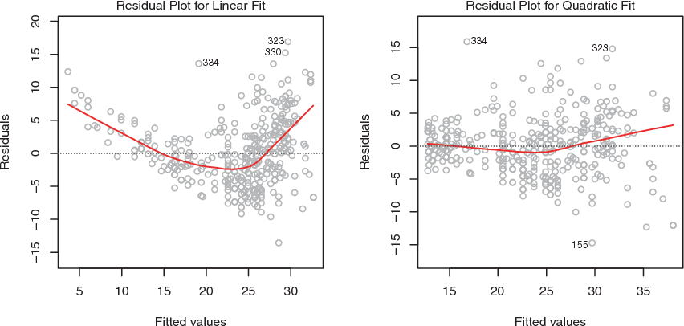
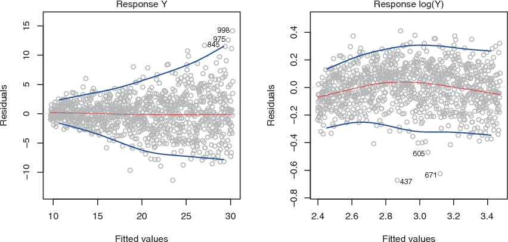
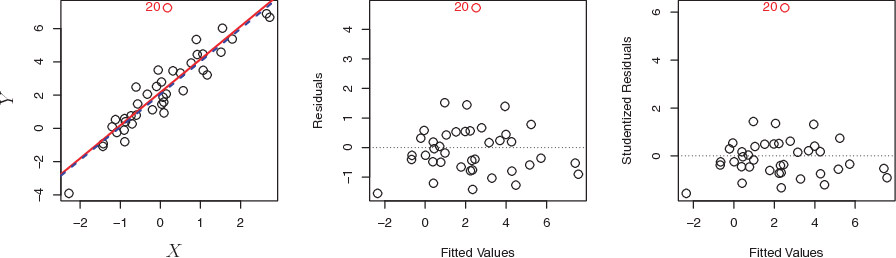
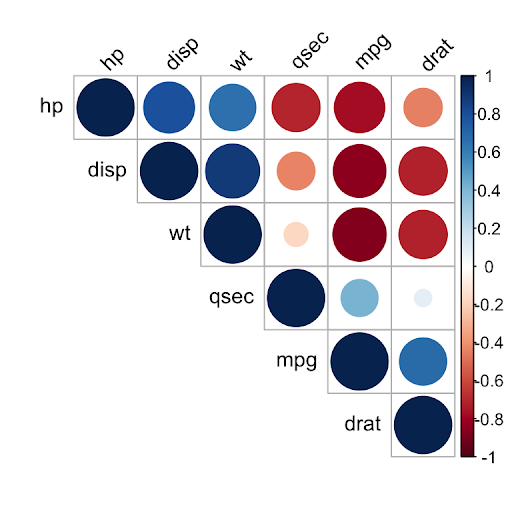

# Other Considerations in the Regression Model

```{r, include = FALSE}
knitr::opts_chunk$set(fig.align="center")
library(ymlthis)
```

```{r echo = FALSE, out.width="65%"}
knitr::include_graphics("img/illos/yours-book.jpg")
```

## Potential Problems {-}

When we fit a linear regression model, many problems can occur, to name a few:

* *Non-linearity of the response-predictor relationships.*
* *Correlation of error terms.*
* *Non-constant variance of error terms.*
* *Outlines.*
* *High-leverage points.*
* *Collinearity.*


## Non-linearity of the Data

The first assumption of Linear Regression is that relations between the independent and dependent variables must be linear.

Although this assumption is not always cited in the literature, it is logical and important to check for it. After all, if your relationships are not linear, you should not use a linear model, but rather a non-linear model of which plenty exist.

We can check for linear relationships easily by making a scatter plot for each independent variable with the dependent variable as in Figure 3.9.

```{r echo=FALSE,  fig.cap='Plots of residuals versus predicted (or fitted) values for the Auto data set'}

```

In each plot, the red line is a smooth fit to the residuals, intended to make it easier to identify a trend. 

* **Left:** A linear regression of `mpg` on horsepower. A strong pattern in the residuals indicates non-linearity in the data. 
* **Right:** A linear regression of `mpg` on `horsepower` and `horsepower2`. There is little pattern in the residuals.


## Correlation of Error Terms

If there is correlation among the error terms $\epsilon_1, \epsilon_2,...,\epsilon_n$, then the estimated standard errors (SE) will tend to underestimate the true SE. As the result, p-value associated with the model will be lower than they should be, which could cause us to erroneously conclude that a parameter is statistically significant.

:::tip
Such correlations frequently occur in the context of *time series* data, which consist of observations for which measurements are obtained at adjacent time points will have positively correlated errors.
   
In order to determine if this is the case for a given data set, we can plot the residuals from our model as a function of time.
:::


Figure 3.10 provides an illustration. **In the top panel**, we see the residuals from a linear regression fit to data generated with uncorrelated errors. There is no evidence of a time-related trend in the residuals.

In contrast, **the residuals in the bottom panel** are from a data set in which adjacent errors had a correlation of 0.9. Now there is a clear pattern in the residuals—adjacent residuals tend to take on similar values. 

Finally, **the center panel** illustrates a more moderate case in which the residuals had a correlation of 0.5. There is still evidence of tracking, but the pattern is less clear.

```{r echo=FALSE,  fig.cap='Plots of residuals from simulated time series data sets generated with differing levels of correlation ρ between error terms for adjacent time'}
knitr::include_graphics("img/109-Figure3.10-1.png")
```


## Non-constant Variance of Error Terms (Heteroscedasticity)

Heteroscedasticity in a model means that the error is constant along the values of the dependent variable.

:::tip
   One can identify non-constant variances in the errors, or heteroscedasticity, from the presence of a funnel shape in heteroscedathe residual plot.
:::

An example is shown in the left-hand panel of Figure 3.11, sticity in which the magnitude of the residuals tends to increase with the fitted values. In each plot, the red line is a smooth fit to the residuals, intended to make it easier to identify a trend. The blue lines track the outer quantiles of the residuals, and emphasize patterns: 

* **Left:** The *funnel shape* indicates heteroscedasticity. 

* **Right:** The response has been log transformed, and there is now no evidence of heteroscedasticity.

```{r echo=FALSE,  fig.cap=' Residual plots'}

```

Some of the suggested solutions are: 

1. ***Do some work on your input data*** like having some variables to add or remove. 

2. ***Do transformations***, like applying concave function such as *logistics* ($logY$) or *square root* $\sqrt{Y}$.

3. If this doesn’t change anything, you can also switch to the ***weighted least squares model***. *Weighted least squares* is a model that can deal with unconstant variances and heteroscedasticity is therefore not a problem. 


## Outlier

An **outlier** is a point for which yi is far from the value predicted by model. Outliers can arise for a variety of reasons, such as incorrect recording of an observation during data collection.

As illustrated in Figure 3.12:

* **Left:** The least squares regression line is shown in red, and the regression line after removing the outlier is shown in blue. 

* **Center:** The residual plot clearly identifies the outlier. 

* **Right:** The outlier has a ***studentized residual*** of 6; typically we expect values between −3 and 3.

```{r echo=FALSE,  fig.cap='Outlier plots'}

```

If we believe that an outlier has occurred due to an error in data collection or recording, then one solution is to simply remove the observation.


## High Leverage Points

In contrast to outlier with unusual for response value $y$, observations with high leverage high leverage have an unusual value for $x_i$.

As illustrated in Figure 3.12:

```{r echo=FALSE,  fig.cap='Leveraging Observations Plots'}
knitr::include_graphics("img/112-Figure3.13-1.png")
```

* **Left:** Observation 41 is a high leverage point, while 20 is not. The red line is the fit to all the data, and the blue line is the fit with observation 41 removed.

* **Center:** The red observation is not unusual in terms of its X1 value or its X2 value, but still falls outside the bulk of the data, and hence has high leverage. 

* **Right:** Observation 41 has a high leverage and a high residual. 


In order to quantify an observation’s leverage, we compute the ***leverage
statistic***.

:::formula
$$
\Large h_i = \frac{1}{n} + \frac{(x_i - \overline{x})^2}{\sum_{i'=1}^{n}(x_i' - \overline x)^2}
$$
:::

A large value of this statistic indicates an observation with high leverage.


## Collinearity

***Collinearity*** refers to the situation in which two or more predictor variables are closely related to one another.

In order to check for collinearity, we can either use ***Correlation Matrix*** or ***Variance Inflation Factor (VIF)***.


### Correlation Matrix

A simple way to detect collinearity is to look at the correlation matrix
of the predictors. An element of this matrix that is large in absolute value indicates a pair of highly correlated variables, and therefore a collinearity problem in the data. 

```{r echo=FALSE,  fig.cap='Sample Correlation Matrix using R'}

```

Unfortunately, not all collinearity problems can be detected by inspection of the correlation matrix: it is possible for collinearity to exist between three or more variables even if no pair of variables has a particularly high correlation. We call this situation ***multicollinearity***.

Multicollinearity causes problems in using regression models to draw conclusions about the relationships between predictors and outcome. An individual predictor's P value may test non-significant even though it is important. Confidence intervals for regression coefficients in a multicollinear model may be so high that tiny changes in individual observations have a large effect on the coefficients, sometimes reversing their signs.


### Variance Inflation Factor (VIF)

Instead of inspecting the correlation matrix, a better way to assess collinearity is to compute the **variance inflation factor (VIF)**. This can easily be calculated in `R` using software packages.

When faced with the problem of collinearity, there are two simple solutions:

1. The first is to drop one of the problematic variables from the regression.

2. The second solution is to combine the collinear variables together into a single predictor.